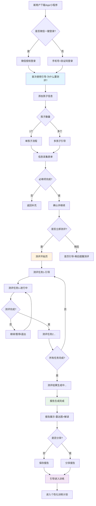

# 专注力测评系统设计方案

> **文档版本**：V1.0  
> **编制日期**：2026年4月  
> **适用范围**：新用户注册后的儿童信息采集、测评任务生成、评估报告生成  
> **产品名称**：专注星球（FocusKids）  
> **方案定位**：为新用户提供「注册→信息采集→测评任务生成→完成测评→生成评估报告」的完整闭环体验

---

## 一、方案概述

### 1.1 核心设计目标

本方案旨在设计一套完整的专注力测评系统，实现以下核心目标：

| 目标 | 描述 | 优先级 |
|------|------|--------|
| **用户友好** | 新用户5分钟内完成信息采集和首次测评，流程自然不劝退 | P0 |
| **科学精准** | 基于五维专注力模型和分龄分级体系，确保测评有效性 | P0 |
| **智能适配** | 根据儿童信息自动生成个性化测评任务组合 | P0 |
| **家长可见** | 测评报告让家长清晰了解孩子专注力现状 | P0 |
| **合规透明** | 明确非医疗定位，避免任何诊断暗示 | P0 |
| **转化引导** | 报告自然引导用户进入训练阶段 | P1 |

### 1.2 方案架构总览

```
┌─────────────────────────────────────────────────────────────────────────────────┐
│                           专注力测评系统架构                                     │
├─────────────────────────────────────────────────────────────────────────────────┤
│                                                                                 │
│  ┌─────────────────┐     ┌─────────────────┐     ┌─────────────────────────┐  │
│  │   用户触达层     │     │   业务逻辑层     │     │       数据层           │  │
│  ├─────────────────┤     ├─────────────────┤     ├─────────────────────────┤  │
│  │ · 注册引导       │ ──▶ │ · 信息采集引擎   │ ──▶ │ · 儿童信息表            │  │
│  │ · 表单交互       │     │ · 测评生成算法   │     │ · 测评任务配置表        │  │
│  │ · 测评引导       │     │ · 报告生成引擎   │     │ · 测评结果表            │  │
│  │ · 报告展示       │     │ · 难度自适应引擎 │     │ · 常模数据库            │  │
│  │                 │     │ · 转化引导模块   │     │ · 雷达图配置表          │  │
│  └─────────────────┘     └─────────────────┘     └─────────────────────────┘  │
│                                                                                 │
└─────────────────────────────────────────────────────────────────────────────────┘
```

---

## 二、用户全流程设计

### 2.1 完整用户流程图



### 2.2 流程节点详细说明

#### 2.2.1 新用户引导页（Why测评）

**设计目标**：让用户理解测评的价值，愿意花5分钟完成测评

**页面内容**：
```
┌─────────────────────────────────────────────────────┐
│                                                     │
│              [可爱动画：小朋友在专注玩耍]            │
│                                                     │
│                  测一测，更懂TA的专注力              │
│                                                     │
│    ─────────────────────────────────────────────   │
│                                                     │
│    📊 了解孩子专注力的"五项能力"                    │
│    🎯 找到孩子专注力的"强项"与"提升空间"           │
│    📈 获得专属的"训练建议"                          │
│    ⏱️ 只需5分钟，科学又轻松                         │
│                                                     │
│    ─────────────────────────────────────────────   │
│                                                     │
│           [  开始了解我的孩子  ]  ⭐              │
│                                                     │
│           [  跳过，先看看  ]                       │
│                                                     │
│    ─────────────────────────────────────────────   │
│                                                     │
│    🔒 测评仅供家庭参考，不能替代专业评估              │
│                                                     │
└─────────────────────────────────────────────────────┘
```

**设计要点**：
- 「开始了解」而非「开始测评」——降低心理门槛
- 明确告知所需时间（5分钟）
- 底部合规声明不可省略

#### 2.2.2 测评任务引导页

**设计目标**：降低儿童焦虑，建立轻松氛围

```
┌─────────────────────────────────────────────────────┐
│                                                     │
│              [探险小分队出发动画]                    │
│                                                     │
│           小专心要带{孩子名字}去探险啦！             │
│                                                     │
│    ─────────────────────────────────────────────   │
│                                                     │
│         这次探险需要完成3个小任务：                  │
│                                                     │
│         🎮 舒尔特方格 - 眼力大挑战                   │
│         🎵 听声辨数   - 耳朵真灵                     │
│         🧩 图案记忆   - 记忆小超人                   │
│                                                     │
│    ─────────────────────────────────────────────   │
│                                                     │
│         ⏱️ 预计用时：5-8分钟                        │
│         💡 可以中途休息哦                           │
│                                                     │
│    ─────────────────────────────────────────────   │
│                                                     │
│           [  准备好了！出发  ]                      │
│                                                     │
└─────────────────────────────────────────────────────┘
```

---

## 三、儿童信息采集设计

### 3.1 采集策略：「最小必填+自然可选」

#### 3.1.1 信息采集字段设计

| 字段名称 | 类型 | 必填 | 设计理由 | 采集时机 |
|----------|------|------|----------|----------|
| **孩子姓名/昵称** | 文本 | ✅ | 报告称呼、个性化体验 | 表单页1 |
| **孩子生日** | 日期选择器 | ✅ | 计算精确年龄、匹配常模 | 表单页1 |
| **孩子性别** | 单选 | ❌ | 可提升报告准确性 | 表单页1 |
| **孩子年级** | 下拉选择 | ❌ | 家长熟悉的参照系 | 表单页2 |
| **家长关注的问题** | 多选+开放式 | ❌ | 了解家长诉求、优化报告 | 表单页2 |

#### 3.1.2 表单分步设计

**第一步（必填项，30秒完成）**：
```
┌─────────────────────────────────────────────────────┐
│                                                     │
│              👶 介绍一下你的孩子                    │
│                                                     │
│    ─────────────────────────────────────────────   │
│                                                     │
│    昵称：                                           │
│    ┌─────────────────────────────────────────┐    │
│    │  小明                                    │    │
│    └─────────────────────────────────────────┘    │
│                                                     │
│    生日：                                           │
│    ┌─────────────────────────────────────────┐    │
│    │  2019年6月                               │    │
│    └─────────────────────────────────────────┘    │
│                                                     │
│    性别：                                           │
│    ┌──────────────┐  ┌──────────────┐            │
│    │  👦 男孩      │  │  👧 女孩      │            │
│    └──────────────┘  └──────────────┘            │
│                                                     │
│           [  继续  ]  →                            │
│                                                     │
└─────────────────────────────────────────────────────┘
```

**第二步（可选项，1分钟完成）**：
```
┌─────────────────────────────────────────────────────┐
│                                                     │
│              🎯 了解更多信息（选填）                 │
│                                                     │
│    这些信息帮助我们提供更准确的建议                  │
│    （不填写也可以继续哦~）                          │
│                                                     │
│    ─────────────────────────────────────────────   │
│                                                     │
│    孩子年级：                                       │
│    ┌─────────────────────────────────────────┐    │
│    │  请选择年级  ▼                          │    │
│    └─────────────────────────────────────────┘    │
│    [幼儿园小班/中班/大班 | 小学1-6年级]           │
│                                                     │
│    你最希望改善什么问题？（可多选）                 │
│    ┌─────────────────┐  ┌─────────────────┐       │
│    │ ☐ 坐不住、好动  │  │ ☐ 上课容易走神  │       │
│    └─────────────────┘  └─────────────────┘       │
│    ┌─────────────────┐  ┌─────────────────┐       │
│    │ ☐ 作业拖拉     │  │ ☐ 粗心马虎      │       │
│    └─────────────────┘  └─────────────────┘       │
│    ┌─────────────────┐  ┌─────────────────┐       │
│    │ ☐ 冲动易怒     │  │ ☐ 其他问题       │       │
│    └─────────────────┘  └─────────────────┘       │
│                                                     │
│    其他想告诉我们的（选填）：                       │
│    ┌─────────────────────────────────────────┐    │
│    │                                         │    │
│    └─────────────────────────────────────────┘    │
│                                                     │
│           [  跳过，继续  ]  或  [  提交  ]        │
│                                                     │
└─────────────────────────────────────────────────────┘
```

#### 3.1.3 竞品对比与设计优势

| 设计要素 | 钟爸专注力 | 专注星球（我们） | 优势说明 |
|----------|------------|------------------|----------|
| 必填字段数 | 6-8个 | 2个（姓名+生日） | 极大降低首次门槛 |
| 选填引导 | 直接列出所有字段 | 分步引导+说明 | 减少认知负担 |
| 问题询问 | "孩子是否..."诊断式 | "家长关注..."需求式 | 避免医疗暗示 |
| 表单时长 | 约3分钟 | 约1.5分钟 | 体验更流畅 |
| 焦虑控制 | 未明确 | 设置跳过选项 | 尊重用户意愿 |

### 3.2 年龄段智能计算

**算法逻辑**：
```python
def calculate_age_group(birthday: date, current_date: date) -> str:
    """
    根据生日计算年龄段
    """
    # 计算精确月龄
    months = (current_date.year - birthday.year) * 12 + \
             (current_date.month - birthday.month)
    
    # 如果当月未过生日，减去1
    if current_date.day < birthday.day:
        months -= 1
    
    # 根据月龄计算年龄段
    if months < 48:  # 4岁以下
        return "3-4岁"
    elif months < 72:  # 4-6岁
        return "5-6岁"
    elif months < 96:  # 6-8岁
        return "7-8岁"
    else:  # 8岁以上
        return "9-12岁"
```

---

## 四、测评任务自动生成算法

### 4.1 测评维度与游戏映射

基于分龄分级体系中的五维专注力模型，我们设计了测评任务与专注力维度的映射关系：

| 专注力维度 | 定义 | 测评游戏 | 测评指标 | 适用年龄段 |
|------------|------|----------|----------|------------|
| **视觉搜索** | 快速扫描并定位目标的能力 | 舒尔特方格 | 完成时间、正确率、漏报数 | 4-12岁 |
| **听觉专注** | 听觉注意力的集中与维持 | 听声辨数 | 正确率、反应时、容量 | 4-12岁 |
| **工作记忆** | 短时存储与操作信息的能力 | 图案记忆 | 正确回忆数、延迟衰减 | 4-12岁 |
| **抗干扰能力** | 在干扰环境下保持专注 | 追踪目标 | 干扰正确率、遗漏率 | 5-12岁 |
| **认知灵活** | 规则切换与认知转移 | 快速分类 | 切换正确率、切换耗时 | 5-12岁 |

### 4.2 测评组合生成算法

#### 4.2.1 测评任务数量配置

| 年龄段 | 测评任务数 | 任务组合 | 预计时长 |
|--------|------------|----------|----------|
| **3-4岁** | 3个 | 舒尔特方格(L1) + 听声辨数(L1) + 图案记忆(L1) | 5-6分钟 |
| **5-6岁** | 4个 | 舒尔特方格(L2) + 听声辨数(L2) + 图案记忆(L2) + 快速分类(L1) | 7-8分钟 |
| **7-8岁** | 5个 | 舒尔特方格(L3) + 听声辨数(L3) + 图案记忆(L3) + 追踪目标(L2) + 快速分类(L2) | 8-10分钟 |
| **9-12岁** | 5个 | 舒尔特方格(L4) + 听声辨数(L4) + 图案记忆(L4) + 追踪目标(L3) + 快速分类(L3) | 10-12分钟 |

#### 4.2.2 智能生成算法

```python
class AssessmentGenerator:
    """
    测评任务生成器
    根据儿童年龄和信息自动生成个性化测评组合
    """
    
    def __init__(self):
        # 测评任务配置
        self.tasks_config = {
            "schulte": {
                "name": "舒尔特方格",
                "dimensions": ["视觉搜索", "持续注意力"],
                "age_ranges": {
                    "3-4": [1],      # 3×3方格
                    "5-6": [1, 2],   # 3×3, 4×4
                    "7-8": [2, 3],   # 4×4, 5×5
                    "9-12": [3, 4], # 5×5, 6×6
                }
            },
            "audio_count": {
                "name": "听声辨数",
                "dimensions": ["听觉专注", "工作记忆"],
                "age_ranges": {
                    "3-4": [1],      # 1-5
                    "5-6": [1, 2],   # 1-5, 1-7
                    "7-8": [2, 3],   # 1-7, 1-10
                    "9-12": [3, 4], # 1-10, 1-15
                }
            },
            "pattern_memory": {
                "name": "图案记忆",
                "dimensions": ["工作记忆", "视觉记忆"],
                "age_ranges": {
                    "3-4": [1],      # 3个图案
                    "5-6": [1, 2],   # 3-4个
                    "7-8": [2, 3],   # 4-5个
                    "9-12": [3, 4], # 5-6个
                }
            },
            "target_track": {
                "name": "追踪目标",
                "dimensions": ["抗干扰", "视觉追踪"],
                "age_ranges": {
                    "3-4": [],       # 该年龄段跳过
                    "5-6": [1],      # 1个目标
                    "7-8": [1, 2],   # 1-2个目标
                    "9-12": [2, 3], # 2-3个目标
                }
            },
            "quick_sort": {
                "name": "快速分类",
                "dimensions": ["认知灵活", "规则切换"],
                "age_ranges": {
                    "3-4": [],       # 该年龄段跳过
                    "5-6": [1],      # 单规则
                    "7-8": [1, 2],   # 单规则+双规则
                    "9-12": [2, 3], # 双规则+混合
                }
            }
        }
    
    def generate_assessment(self, age_group: str, 
                           parent_concerns: list = None) -> dict:
        """
        生成测评任务组合
        
        Args:
            age_group: 年龄段，如 "5-6岁"
            parent_concerns: 家长关注的问题列表
            
        Returns:
            包含测评任务的配置信息
        """
        # 映射年龄段到key
        age_key = age_group.replace("岁", "").replace("-", "-")
        
        # 选择该年龄段可用的任务
        available_tasks = []
        for task_id, config in self.tasks_config.items():
            if age_key in config["age_ranges"]:
                if config["age_ranges"][age_key]:  # 有可用难度
                    available_tasks.append({
                        "task_id": task_id,
                        "name": config["name"],
                        "dimensions": config["dimensions"],
                        "difficulty_levels": config["age_ranges"][age_key],
                        "priority": self._calculate_priority(
                            config["dimensions"], 
                            parent_concerns
                        )
                    })
        
        # 按优先级排序，选择核心任务
        available_tasks.sort(key=lambda x: x["priority"], reverse=True)
        
        # 根据年龄段确定任务数量
        task_count = self._get_task_count(age_group)
        selected_tasks = available_tasks[:task_count]
        
        # 确定每个任务的起始难度
        for task in selected_tasks:
            task["start_level"] = task["difficulty_levels"][0]
        
        return {
            "task_count": len(selected_tasks),
            "estimated_duration": self._estimate_duration(age_group),
            "tasks": selected_tasks
        }
    
    def _calculate_priority(self, dimensions: list, 
                           parent_concerns: list) -> int:
        """
        根据家长关注问题计算任务优先级
        """
        if not parent_concerns:
            return 50  # 默认优先级
        
        priority_map = {
            "坐不住、好动": ["持续注意力", "冲动控制"],
            "上课容易走神": ["持续注意力", "视觉搜索"],
            "作业拖拉": ["工作记忆", "计划能力"],
            "粗心马虎": ["视觉搜索", "注意力稳定性"],
            "冲动易怒": ["冲动控制", "情绪调节"]
        }
        
        score = 50
        for concern in parent_concerns:
            if concern in priority_map:
                for dim in priority_map[concern]:
                    if dim in dimensions:
                        score += 10
        
        return min(score, 100)  # 最高100分
    
    def _get_task_count(self, age_group: str) -> int:
        """获取该年龄段的测评任务数量"""
        counts = {
            "3-4岁": 3,
            "5-6岁": 4,
            "7-8岁": 5,
            "9-12岁": 5
        }
        return counts.get(age_group, 5)
    
    def _estimate_duration(self, age_group: str) -> int:
        """估算测评时长（分钟）"""
        durations = {
            "3-4岁": 6,
            "5-6岁": 8,
            "7-8岁": 10,
            "9-12岁": 12
        }
        return durations.get(age_group, 10)
```

### 4.3 难度自适应机制

#### 4.3.1 自适应策略

每个测评任务采用「渐进式自适应」策略：

```
┌─────────────────────────────────────────────────────┐
│              测评难度自适应流程                      │
├─────────────────────────────────────────────────────┤
│                                                     │
│   [任务开始]                                         │
│       │                                              │
│       ▼                                              │
│   [Level 1 (起始难度)]                               │
│       │                                              │
│       ├── 正确率 ≥ 80% ──▶ [升级到Level 2] ──▶ ... │
│       │                                              │
│       ├── 正确率 50-80% ──▶ [保持当前Level]        │
│       │                                              │
│       └── 正确率 < 50% ──▶ [降级或提供帮助]        │
│                                                     │
│   [3轮后确定基准难度]                                │
│       │                                              │
│       ▼                                              │
│   [完成测评任务]                                     │
│                                                     │
└─────────────────────────────────────────────────────┘
```

#### 4.3.2 测评流程体验设计

**测评节奏控制**：

| 环节 | 时长 | 设计要点 |
|------|------|----------|
| 任务引导 | 10-15秒 | 简短动画+语音说明 |
| 练习轮次 | 1-2轮 | 不计入成绩，消除紧张感 |
| 正式测评 | 60-90秒/任务 | 可中途休息 |
| 休息间隔 | 10-15秒 | 鼓励动画+喝水提示 |
| 结束引导 | 20-30秒 | 感谢+报告预告 |

**休息设计**：
```
┌─────────────────────────────────────────────────────┐
│                                                     │
│                 💧 休息一下！                       │
│                                                     │
│           完成 2/5 任务啦，真棒！                    │
│                                                     │
│    ┌─────────────────────────────────────────┐    │
│    │                                         │    │
│    │         [喝水动画/伸展动画]              │    │
│    │                                         │    │
│    └─────────────────────────────────────────┘    │
│                                                     │
│              下一任务：听声辨数                      │
│                                                     │
│           [  继续挑战  ]  [  休息一下  ]           │
│                                                     │
└─────────────────────────────────────────────────────┘
```

---

## 五、评估报告生成设计

### 5.1 报告结构设计

#### 5.1.1 报告内容框架

```
┌─────────────────────────────────────────────────────┐
│                   评估报告目录                        │
├─────────────────────────────────────────────────────┤
│                                                     │
│  1️⃣  报告概览                                       │
│      - 孩子基本信息                                  │
│      - 测评完成情况                                  │
│      - 综合得分                                      │
│                                                     │
│  2️⃣  五维能力雷达图                                 │
│      - 视觉搜索能力                                  │
│      - 听觉专注能力                                  │
│      - 工作记忆能力                                  │
│      - 抗干扰能力                                    │
│      - 认知灵活性                                    │
│                                                     │
│  3️⃣  同龄对比分析                                   │
│      - 与同龄孩子的百分位对比                        │
│      - 各维度排名                                    │
│                                                     │
│  4️⃣  问题诊断与解读                                 │
│      - 强项分析                                      │
│      - 提升空间                                      │
│      - 发展建议                                      │
│                                                     │
│  5️⃣  训练建议方案                                   │
│      - 个性化训练计划                                │
│      - 每日训练任务推荐                              │
│      - 家长配合要点                                  │
│                                                     │
│  6️⃣  下次测评计划                                   │
│      - 建议复测时间                                  │
│      - 进步预期                                      │
│                                                     │
└─────────────────────────────────────────────────────┘
```

#### 5.1.2 报告首页设计

```
┌─────────────────────────────────────────────────────┐
│                                                     │
│                   📊 专注力评估报告                   │
│                                                     │
│               小明的专注力档案                       │
│                                                     │
│    ─────────────────────────────────────────────   │
│                                                     │
│    👤 基本信息                                       │
│    ┌─────────────────────────────────────────┐    │
│    │  姓名：小明    性别：男                   │    │
│    │  年龄：6岁3个月                          │    │
│    │  测评日期：2026年4月15日                  │    │
│    │  测评时长：8分钟                         │    │
│    └─────────────────────────────────────────┘    │
│                                                     │
│    ⭐ 综合评估                                       │
│    ┌─────────────────────────────────────────┐    │
│    │                                         │    │
│    │         综合百分位：P72                  │    │
│    │         评级：【良好】                   │    │
│    │                                         │    │
│    │         ████████████░░░░  72%          │    │
│    │                                         │    │
│    └─────────────────────────────────────────┘    │
│                                                     │
│    📋 测评项目完成情况                               │
│    ┌─────────────────────────────────────────┐    │
│    │  ✅ 舒尔特方格  - 完成                   │    │
│    │  ✅ 听声辨数    - 完成                   │    │
│    │  ✅ 图案记忆    - 完成                   │    │
│    │  ✅ 快速分类    - 完成                   │    │
│    └─────────────────────────────────────────┘    │
│                                                     │
│              [  查看详细报告  ]                      │
│                                                     │
└─────────────────────────────────────────────────────┘
```

### 5.2 五维雷达图设计

#### 5.2.1 雷达图展示

```
┌─────────────────────────────────────────────────────┐
│                                                     │
│              小明的五维能力分析                      │
│                                                     │
│                      视觉搜索                        │
│                       85分                          │
│                         ▲                          │
│                        /│\                         │
│                       / │ \                        │
│                      /  │  \                       │
│            认知灵活  /   │   \ 听觉专注              │
│              78分 ◄────┼────► 80分                 │
│                    \   │   /                        │
│                     \  │  /                         │
│                      \ │ /                          │
│                       \│/                           │
│                        ▼                            │
│                     工作记忆                        │
│                       68分                          │
│                                                     │
│    ─────────────────────────────────────────────   │
│                                                     │
│    📊 各维度解读                                     │
│                                                     │
│    ┌─────────────────────────────────────────┐    │
│    │ 🟢 视觉搜索 (85分) 优秀                  │    │
│    │    视觉扫描速度快，准确率高              │    │
│    └─────────────────────────────────────────┘    │
│    ┌─────────────────────────────────────────┐    │
│    │ 🟢 听觉专注 (80分) 良好                  │    │
│    │    听觉注意力稳定，辨音能力较强          │    │
│    └─────────────────────────────────────────┘    │
│    ┌─────────────────────────────────────────┐    │
│    │ 🟡 工作记忆 (68分) 正常                  │    │
│    │    在正常范围内，有提升空间              │    │
│    └─────────────────────────────────────────┘    │
│                                                     │
└─────────────────────────────────────────────────────┘
```

#### 5.2.2 雷达图数据模型

```python
class RadarChartData:
    """
    五维雷达图数据模型
    """
    
    # 五维能力指标定义
    DIMENSIONS = [
        {"id": "visual_search", "name": "视觉搜索", "icon": "👁️"},
        {"id": "auditory_attention", "name": "听觉专注", "icon": "👂"},
        {"id": "working_memory", "name": "工作记忆", "icon": "🧠"},
        {"id": "anti_interference", "name": "抗干扰", "icon": "🛡️"},
        {"id": "cognitive_flex", "name": "认知灵活", "icon": "🔄"},
    ]
    
    def __init__(self, assessment_results: dict, 
                 age_group: str, gender: str = None):
        self.assessment_results = assessment_results
        self.age_group = age_group
        self.gender = gender
    
    def calculate_dimension_scores(self) -> dict:
        """
        根据测评结果计算各维度得分
        """
        # 原始分映射到标准分
        dimension_scores = {}
        
        # 视觉搜索 = 舒尔特方格得分
        schulte_score = self._normalize_score(
            self.assessment_results.get("schulte", {}),
            "time_score",  # 用时越短越好
            self._get_norm_data("visual_search")
        )
        dimension_scores["visual_search"] = schulte_score
        
        # 听觉专注 = 听声辨数正确率
        audio_score = self._normalize_score(
            self.assessment_results.get("audio_count", {}),
            "accuracy",
            self._get_norm_data("auditory_attention")
        )
        dimension_scores["auditory_attention"] = audio_score
        
        # 工作记忆 = 图案记忆正确回忆数
        memory_score = self._normalize_score(
            self.assessment_results.get("pattern_memory", {}),
            "correct_recall",
            self._get_norm_data("working_memory")
        )
        dimension_scores["working_memory"] = memory_score
        
        # 抗干扰 = 追踪目标正确率
        if "target_track" in self.assessment_results:
            anti_score = self._normalize_score(
                self.assessment_results.get("target_track", {}),
                "accuracy",
                self._get_norm_data("anti_interference")
            )
            dimension_scores["anti_interference"] = anti_score
        else:
            dimension_scores["anti_interference"] = None
        
        # 认知灵活 = 快速分类正确率和切换效率
        if "quick_sort" in self.assessment_results:
            flex_score = self._normalize_score(
                self.assessment_results.get("quick_sort", {}),
                "switch_accuracy",
                self._get_norm_data("cognitive_flex")
            )
            dimension_scores["cognitive_flex"] = flex_score
        else:
            dimension_scores["cognitive_flex"] = None
        
        return dimension_scores
    
    def _normalize_score(self, task_result: dict, 
                        metric: str, 
                        norm_data: dict) -> int:
        """
        将原始分转换为标准分（0-100）
        """
        raw_score = task_result.get(metric, 0)
        norm_mean = norm_data["mean"]
        norm_std = norm_data["std"]
        
        # Z分数
        z_score = (raw_score - norm_mean) / norm_std
        
        # 转换为百分制（均分50，标准差15）
        standard_score = 50 + z_score * 15
        
        # 限制范围 0-100
        return max(0, min(100, int(standard_score)))
```

### 5.3 同龄对比分析

#### 5.3.1 百分位展示

```
┌─────────────────────────────────────────────────────┐
│                                                     │
│              📈 小明在同龄孩子中的表现                │
│                                                     │
│    ─────────────────────────────────────────────   │
│                                                     │
│    综合百分位：P72                                   │
│                                                     │
│    ┌─────────────────────────────────────────┐    │
│    │                                         │    │
│    │  0   20   40   60   80   90  95  100   │    │
│    │  ├────┼────┼────┼────┼────┼───┼───┤   │    │
│    │        ████████████████                │    │
│    │             ↑                          │    │
│    │           小明                         │    │
│    │                    ↑                   │    │
│    │                  72%                   │    │
│    │                                         │    │
│    │  ████████████████████████████          │    │
│    │  小明超越了72%的同龄孩子                 │    │
│    │                                         │    │
│    └─────────────────────────────────────────┘    │
│                                                     │
│    各维度百分位：                                    │
│    ┌─────────────────────────────────────────┐    │
│    │  视觉搜索    ████████████████████  P85  │    │
│    │  听觉专注    ████████████████     P78  │    │
│    │  工作记忆    █████████████         P68  │    │
│    │  抗干扰      ██████████████████   P80  │    │
│    │  认知灵活    ████████████████     P75  │    │
│    └─────────────────────────────────────────┘    │
│                                                     │
└─────────────────────────────────────────────────────┘
```

#### 5.3.2 五级评级体系

基于分龄分级体系，我们采用五级评级：

| 评级 | 百分位范围 | 标签 | 颜色 | 建议行动 |
|------|------------|------|------|----------|
| 🌟 **超越卓越** | P90-P99 | 超越卓越 | 金色 | 保持现有表现，可探索更高挑战 |
| ✅ **良好发展** | P70-P89 | 良好发展 | 绿色 | 继续保持，适度挑战促进成长 |
| 📊 **普通范围** | P30-P69 | 普通范围 | 蓝色 | 符合年龄预期，可针对性提升 |
| ⚠️ **需要关注** | P10-P29 | 需要关注 | 橙色 | 建议持续观察，可考虑预防性训练 |
| 🔍 **建议专业评估** | <P10 | 建议专业评估 | 红色 | 建议寻求专业评估 |

### 5.4 问题诊断与解读

#### 5.4.1 强项分析模板

```
┌─────────────────────────────────────────────────────┐
│                                                     │
│              ✨ 小明的专注力强项                      │
│                                                     │
│    ─────────────────────────────────────────────   │
│                                                     │
│    🏆 视觉搜索能力突出                               │
│                                                     │
│    小明在舒尔特方格测试中表现出色，                  │
│    完成速度超过了85%的同龄孩子。                     │
│                                                     │
│    这说明：                                         │
│    • 视觉扫描效率高，能够快速定位目标                │
│    • 眼球运动控制能力发展良好                        │
│    • 在需要"找东西"的场景中表现出色                  │
│                                                     │
│    💡 建议：在日常学习中可以多利用视觉提示，         │
│       如图表、颜色标记等，发挥这项优势               │
│                                                     │
└─────────────────────────────────────────────────────┘
```

#### 5.4.2 提升空间分析模板

```
┌─────────────────────────────────────────────────────┐
│                                                     │
│              📈 小明的专注力提升空间                   │
│                                                     │
│    ─────────────────────────────────────────────   │
│                                                     │
│    🎯 工作记忆能力有提升空间                         │
│                                                     │
│    在图案记忆测试中，小明能正确回忆68%的图案，        │
│    与同龄孩子平均水平相当。                          │
│                                                     │
│    这意味着：                                       │
│    • 在课堂上需要多次重复才能记住新知识              │
│    • 做作业时可能需要更频繁地回顾题目                │
│    • 复杂的多步骤指令执行起来可能有困难              │
│                                                     │
│    💡 建议：通过游戏化训练（如记忆翻翻乐）           │
│       每天练习5-10分钟，可以有效提升工作记忆          │
│                                                     │
│    🎮 推荐训练游戏：                                 │
│    • 图案记忆（视觉工作记忆训练）                    │
│    • 听声辨数（听觉工作记忆训练）                    │
│                                                     │
└─────────────────────────────────────────────────────┘
```

### 5.5 训练建议方案

#### 5.5.1 个性化训练计划

```
┌─────────────────────────────────────────────────────┐
│                                                     │
│              🎯 专属训练计划                         │
│                                                     │
│    为小明定制的每日训练方案                          │
│                                                     │
│    ─────────────────────────────────────────────   │
│                                                     │
│    📅 每日训练目标（10-15分钟）                      │
│                                                     │
│    ┌─────────────────────────────────────────┐    │
│    │                                         │    │
│    │  🎮 舒尔特方格    5分钟  × 3关          │    │
│    │     (巩固视觉搜索优势)                   │    │
│    │                                         │    │
│    │  🧩 图案记忆      5分钟  × 2关          │    │
│    │     (提升工作记忆)                       │    │
│    │                                         │    │
│    │  🎵 听声辨数      3分钟  × 2关          │    │
│    │     (综合听觉专注)                       │    │
│    │                                         │    │
│    └─────────────────────────────────────────┘    │
│                                                     │
│    👨‍👩‍👧 家长配合要点                               │
│    ┌─────────────────────────────────────────┐    │
│    │  1. 选择孩子精力充沛的时间段训练          │    │
│    │  2. 训练时减少环境干扰（关电视/手机）    │    │
│    │  3. 多给予鼓励，少批评                    │    │
│    │  4. 每周与孩子一起回顾进步                │    │
│    └─────────────────────────────────────────┘    │
│                                                     │
│    📆 建议4周后复测                                 │
│                                                     │
│              [  开始今日训练  ]                      │
│                                                     │
└─────────────────────────────────────────────────────┘
```

---

## 六、常模数据库设计

### 6.1 常模数据结构

#### 6.1.1 常模数据表结构

```sql
-- 专注力测评常模数据表
CREATE TABLE attention_norms (
    norm_id BIGINT PRIMARY KEY AUTO_INCREMENT,
    dimension VARCHAR(50) NOT NULL,           -- 维度：visual_search, auditory_attention...
    age_group VARCHAR(20) NOT NULL,           -- 年龄段：3-4岁, 5-6岁, 7-8岁, 9-12岁
    gender VARCHAR(10),                         -- 性别：男, 女, 全部
    metric_name VARCHAR(50) NOT NULL,         -- 指标名称
    sample_size INT,                           -- 样本量
    mean_value DECIMAL(10, 2),                 -- 均值
    std_value DECIMAL(10, 2),                 -- 标准差
    p10_value DECIMAL(10, 2),                 -- 10百分位
    p25_value DECIMAL(10, 2),                 -- 25百分位
    p50_value DECIMAL(10, 2),                 -- 50百分位（中位数）
    p75_value DECIMAL(10, 2),                 -- 75百分位
    p90_value DECIMAL(10, 2),                 -- 90百分位
    norm_year INT,                             -- 常模年份
    region VARCHAR(50),                        -- 地域（全国/华东/华南...）
    created_at TIMESTAMP DEFAULT CURRENT_TIMESTAMP,
    updated_at TIMESTAMP DEFAULT CURRENT_TIMESTAMP ON UPDATE CURRENT_TIMESTAMP,
    
    INDEX idx_dimension_age (dimension, age_group),
    INDEX idx_age_gender (age_group, gender)
);
```

#### 6.1.2 初始常模数据（基于分龄分级体系）

| 维度 | 年龄段 | 均值 | 标准差 | P10 | P25 | P50 | P75 | P90 | 说明 |
|------|--------|------|--------|-----|-----|-----|-----|-----|------|
| **视觉搜索** | 3-4岁 | 35秒 | 8秒 | 45秒 | 40秒 | 35秒 | 30秒 | 25秒 | 5×5完成时间 |
| **视觉搜索** | 5-6岁 | 40秒 | 10秒 | 52秒 | 46秒 | 40秒 | 34秒 | 28秒 | 5×5完成时间 |
| **视觉搜索** | 7-8岁 | 30秒 | 8秒 | 40秒 | 35秒 | 30秒 | 25秒 | 21秒 | 5×5完成时间 |
| **视觉搜索** | 9-12岁 | 25秒 | 6秒 | 33秒 | 28秒 | 25秒 | 21秒 | 18秒 | 5×5完成时间 |
| **听觉专注** | 3-4岁 | 75% | 12% | 61% | 68% | 75% | 82% | 89% | 辨数正确率 |
| **听觉专注** | 5-6岁 | 80% | 10% | 68% | 74% | 80% | 86% | 92% | 辨数正确率 |
| **听觉专注** | 7-8岁 | 85% | 8% | 75% | 80% | 85% | 90% | 95% | 辨数正确率 |
| **听觉专注** | 9-12岁 | 88% | 6% | 80% | 84% | 88% | 92% | 96% | 辨数正确率 |
| **工作记忆** | 3-4岁 | 3个 | 0.8个 | 2个 | 2.5个 | 3个 | 3.5个 | 4个 | 正确回忆数 |
| **工作记忆** | 5-6岁 | 4个 | 1个 | 2.8个 | 3.4个 | 4个 | 4.6个 | 5.2个 | 正确回忆数 |
| **工作记忆** | 7-8岁 | 5个 | 1.2个 | 3.5个 | 4.3个 | 5个 | 5.7个 | 6.5个 | 正确回忆数 |
| **工作记忆** | 9-12岁 | 6个 | 1.5个 | 4.2个 | 5.1个 | 6个 | 6.9个 | 7.8个 | 正确回忆数 |

### 6.2 常模更新机制

#### 6.2.1 数据积累策略

```
┌─────────────────────────────────────────────────────┐
│                 常模数据积累流程                      │
├─────────────────────────────────────────────────────┤
│                                                     │
│   阶段1：初始常模（上线前）                          │
│   └── 基于文献+专家经验建立初始常模                  │
│                                                     │
│   阶段2：种子用户数据（上线后1-3个月）               │
│   └── 收集1000+有效测评数据                         │
│   └── 清洗异常值，补充真实数据                      │
│                                                     │
│   阶段3：持续优化（上线3个月后）                     │
│   └── 每月更新常模参数                              │
│   └── 按季度发布新常模版本                          │
│                                                     │
│   阶段4：精细化常模（上线1年后）                     │
│   └── 分地域常模                                    │
│   └── 分性别常模（可选）                            │
│   └── 分年级常模（更精细）                          │
│                                                     │
└─────────────────────────────────────────────────────┘
```

#### 6.2.2 常模更新算法

```python
class NormUpdater:
    """
    常模数据自动更新器
    """
    
    def __init__(self, db_connection):
        self.db = db_connection
    
    def update_norms(self, dimension: str, 
                     age_group: str) -> dict:
        """
        基于新数据更新常模
        
        Args:
            dimension: 维度名称
            age_group: 年龄段
            
        Returns:
            更新后的常模统计量
        """
        # 获取最近3个月的数据
        raw_data = self._get_recent_data(
            dimension, age_group, 
            months=3, min_samples=100
        )
        
        if not raw_data:
            return None
        
        # 计算统计量
        import numpy as np
        
        values = [d["metric_value"] for d in raw_data]
        
        stats = {
            "sample_size": len(values),
            "mean_value": np.mean(values),
            "std_value": np.std(values),
            "p10_value": np.percentile(values, 10),
            "p25_value": np.percentile(values, 25),
            "p50_value": np.percentile(values, 50),
            "p75_value": np.percentile(values, 75),
            "p90_value": np.percentile(values, 90),
        }
        
        # 更新数据库
        self._update_norm_table(dimension, age_group, stats)
        
        return stats
```

---

## 七、合规措辞规范

### 7.1 合规红线清单

> ⚠️ **严格禁止的表述**

| 禁止类型 | 禁止示例 | 违规原因 |
|----------|----------|----------|
| **医疗诊断** | "诊断为ADHD"、"疑似多动症" | 超出产品能力范围 |
| **治疗宣称** | "治疗注意力缺陷"、"治愈多动" | 违反医疗器械法规 |
| **疗效承诺** | "30天治愈"、"保证提高注意力" | 无法保证绝对效果 |
| **专业背书滥用** | "医院推荐"、"临床验证" | 无资质背书 |
| **焦虑营销** | "你的孩子可能有多动症" | 制造家长恐慌 |

### 7.2 替代表述方案

| 禁止表述 | 替代方案 |
|----------|----------|
| "诊断" | "了解"、"评估"、"分析" |
| "治疗" | "训练"、"培养"、"提升" |
| "治愈" | "改善"、"增强"、"发展" |
| "多动症/ADHD" | "专注力提升"、"注意力发展" |
| "注意力缺陷" | "专注力有提升空间"、"注意力可以更强" |

### 7.3 报告合规模板

#### 7.3.1 报告顶部声明

```
┌─────────────────────────────────────────────────────┐
│                                                     │
│  ⚠️  重要提示                                        │
│                                                     │
│  本报告由专注星球APP基于游戏化测评任务生成，          │
│  仅供家庭参考和辅助了解，不能替代专业医疗评估。        │
│                                                     │
│  专注力的发展和提升受多种因素影响，包括生理、          │
│  心理、环境和教育等。本报告仅供参考，不能作为          │
│  医学诊断依据。                                      │
│                                                     │
│  如您对孩子的专注力发展有疑虑，建议咨询专业的          │
│  儿童心理或发育行为医生。                            │
│                                                     │
└─────────────────────────────────────────────────────┘
```

#### 7.3.2 各评级合规表述

| 评级 | 合规表述 | 禁止表述 |
|------|----------|----------|
| 🌟 **超越卓越** | "专注力表现优秀，超越大多数同龄孩子" | "完全没有注意力问题" |
| ✅ **良好发展** | "专注力发展良好，保持现有状态即可" | "没问题，不需要训练" |
| 📊 **普通范围** | "专注力在正常范围内，可通过训练进一步提升" | "正常，无需关注" |
| ⚠️ **需要关注** | "专注力发展需要家长关注，可以通过训练改善" | "疑似注意力障碍" |
| 🔍 **建议专业评估** | "建议咨询专业人士进行详细评估" | "确诊为ADHD/多动症" |

### 7.4 2026年合规新规应对

#### 7.4.1 新规要点（预测）

| 法规 | 预测要点 | 应对措施 |
|------|----------|----------|
| 《互联网广告管理办法》 | 不得以"测评"名义进行注意力问题暗示性宣传 | 报告使用"了解"而非"诊断"等表述 |
| 《儿童个人信息网络保护规定》 | 未成年人信息采集需单独授权 | 增加家长知情确认流程 |
| 《在线教育规范》 | 不得以"提升注意力/记忆力"做疗效承诺 | 使用"有助于发展"等软性表述 |
| 《网络数据安全管理》 | 测评数据跨境需安全评估 | 本地化存储，不出境 |

#### 7.4.2 合规自查清单

```
□ 报告首页包含"非医疗诊断"声明
□ 不使用"治疗"、"诊断"、"痊愈"等词汇
□ 不展示专业医疗量表（如SNAP-IV完整版）
□ 不承诺具体疗效（如"提高XX分"）
□ 家长需阅读并同意隐私政策
□ 未成年人信息采集需监护人授权
□ 测评数据存储于国内服务器
□ 设置家长投诉和反馈渠道
```

---

## 八、与竞品差异化分析

### 8.1 对比钟爸专注力五维测评体系

| 维度 | 钟爸专注力 | 专注星球（我们） | 差异化优势 |
|------|------------|------------------|------------|
| **测评维度** | 5维（注意、记忆、执行、控制、情绪） | 5维（视觉搜索、听觉专注、工作记忆、抗干扰、认知灵活） | 更细分的注意力子维度 |
| **测评方式** | 问卷+简单游戏 | 专业游戏任务+行为数据 | 游戏化+数据化，更客观 |
| **常模体系** | 公开程度有限 | 透明化常模设计 | 可解释性更强 |
| **报告深度** | 评分+建议 | 雷达图+百分位+训练方案 | 更全面的个性化报告 |
| **后续转化** | 课程推荐 | 个性化训练计划+游戏推荐 | 无缝衔接训练闭环 |

### 8.2 对比成长脑等头部竞品

| 功能 | 成长脑 | Lumosity | 专注星球（我们） | 优势 |
|------|--------|----------|------------------|------|
| **儿童适配** | 成人为主 | 13+岁 | 4-12岁专属 | 年龄段精准 |
| **家长端** | 无 | 无 | 完整家长报告 | 家长信任 |
| **游戏化** | 低 | 中 | 高 | 儿童喜欢 |
| **科学性** | 高 | 高 | 高+儿童适配 | 专业且适龄 |
| **中国本地化** | 一般 | 无 | 深度本地化 | 文化匹配 |
| **测评转化** | 弱 | 弱 | 强 | 商业闭环 |

### 8.3 我们的核心差异化卖点

```
┌─────────────────────────────────────────────────────┐
│                                                     │
│            🌟 专注星球测评系统 核心卖点              │
│                                                     │
│    ━━━━━━━━━━━━━━━━━━━━━━━━━━━━━━━━━━━━━━━━━━━━━   │
│                                                     │
│    1️⃣  "5分钟读懂孩子的专注力"                      │
│        └── 极简流程 + 即时报告                       │
│                                                     │
│    2️⃣  "游戏化测评，不让孩子紧张"                    │
│        └── 趣味引导 + 渐进式任务                     │
│                                                     │
│    3️⃣  "科学但不晦涩，家长看得懂"                     │
│        └── 雷达图+百分位+白话解读                   │
│                                                     │
│    4️⃣  "测评完就知道该练什么"                        │
│        └── 无缝衔接个性化训练                        │
│                                                     │
│    5️⃣  "专注训练，而非诊断问题"                      │
│        └── 合规透明，去医疗化                        │
│                                                     │
│    ━━━━━━━━━━━━━━━━━━━━━━━━━━━━━━━━━━━━━━━━━━━━━   │
│                                                     │
└─────────────────────────────────────────────────────┘
```

---

## 九、技术实现要点

### 9.1 核心数据表设计

```sql
-- 儿童信息表
CREATE TABLE child_info (
    child_id BIGINT PRIMARY KEY AUTO_INCREMENT,
    parent_id BIGINT NOT NULL,
    name VARCHAR(50) NOT NULL,
    nickname VARCHAR(50),
    birthday DATE NOT NULL,
    age_group VARCHAR(20),                  -- 存储计算的年龄段
    gender VARCHAR(10),
    grade VARCHAR(50),
    parent_concerns JSON,                    -- 家长关注问题
    avatar_url VARCHAR(255),
    created_at TIMESTAMP DEFAULT CURRENT_TIMESTAMP,
    updated_at TIMESTAMP DEFAULT CURRENT_TIMESTAMP ON UPDATE CURRENT_TIMESTAMP,
    
    INDEX idx_parent (parent_id)
);

-- 测评任务配置表
CREATE TABLE assessment_config (
    config_id BIGINT PRIMARY KEY AUTO_INCREMENT,
    task_id VARCHAR(50) NOT NULL,
    task_name VARCHAR(100) NOT NULL,
    dimension VARCHAR(50) NOT NULL,
    difficulty_level INT NOT NULL,
    age_groups JSON,                        -- 适用的年龄段列表
    duration_seconds INT,                    -- 预计时长
    instructions TEXT,                       -- 任务说明
    is_active BOOLEAN DEFAULT TRUE,
    
    INDEX idx_task_age (task_id, age_groups)
);

-- 测评会话表
CREATE TABLE assessment_session (
    session_id BIGINT PRIMARY KEY AUTO_INCREMENT,
    child_id BIGINT NOT NULL,
    age_group VARCHAR(20),
    status VARCHAR(20),                      -- pending/running/completed/aborted
    total_tasks INT,
    completed_tasks INT,
    started_at TIMESTAMP,
    completed_at TIMESTAMP,
    estimated_duration INT,                  -- 预计时长（分钟）
    actual_duration INT,                     -- 实际时长（分钟）
    
    INDEX idx_child (child_id),
    INDEX idx_status (status)
);

-- 测评结果表
CREATE TABLE assessment_result (
    result_id BIGINT PRIMARY KEY AUTO_INCREMENT,
    session_id BIGINT NOT NULL,
    task_id VARCHAR(50) NOT NULL,
    difficulty_level INT,
    raw_data JSON,                           -- 原始数据
    processed_data JSON,                      -- 处理后的指标数据
    dimension_scores JSON,                    -- 各维度得分
    duration_seconds INT,
    created_at TIMESTAMP DEFAULT CURRENT_TIMESTAMP,
    
    INDEX idx_session (session_id)
);

-- 评估报告表
CREATE TABLE assessment_report (
    report_id BIGINT PRIMARY KEY AUTO_INCREMENT,
    child_id BIGINT NOT NULL,
    session_id BIGINT NOT NULL,
    report_data JSON,                        -- 完整报告数据
    radar_chart_data JSON,                   -- 雷达图数据
    dimension_scores JSON,                    -- 五维得分
    composite_score INT,                      -- 综合百分位
    rating VARCHAR(20),                      -- 评级
    strengths TEXT,                          -- 强项分析
    improvements TEXT,                        -- 提升建议
    training_plan JSON,                      -- 训练计划
    created_at TIMESTAMP DEFAULT CURRENT_TIMESTAMP,
    updated_at TIMESTAMP DEFAULT CURRENT_TIMESTAMP ON UPDATE CURRENT_TIMESTAMP,
    
    INDEX idx_child (child_id),
    INDEX idx_session (session_id)
);
```

### 9.2 API接口设计

```yaml
# 测评系统API设计

# 1. 创建测评会话
POST /api/v1/assessment/sessions
Request:
{
  "child_id": 12345,
  "generate_plan": true  # 是否自动生成测评计划
}
Response:
{
  "session_id": "ASS20260415001",
  "task_count": 4,
  "estimated_duration": 8,
  "tasks": [
    {
      "task_id": "schulte",
      "task_name": "舒尔特方格",
      "difficulty_level": 2,
      "order": 1
    },
    ...
  ]
}

# 2. 提交测评任务结果
POST /api/v1/assessment/tasks/{task_id}/submit
Request:
{
  "session_id": "ASS20260415001",
  "child_id": 12345,
  "difficulty_level": 2,
  "raw_results": {
    "duration": 45.2,
    "correct_count": 23,
    "error_count": 2,
    "time_sequence": [...]
  }
}
Response:
{
  "task_result_id": "TASK20260415001",
  "dimension_scores": {
    "visual_search": 85,
    "sustained_attention": 78
  }
}

# 3. 获取评估报告
GET /api/v1/assessment/reports/{session_id}
Response:
{
  "report_id": "RPT20260415001",
  "child_name": "小明",
  "child_age_group": "5-6岁",
  "assessment_date": "2026-04-15",
  "composite_score": 72,
  "rating": "良好发展",
  "radar_chart": {
    "visual_search": 85,
    "auditory_attention": 80,
    "working_memory": 68,
    "anti_interference": 75,
    "cognitive_flex": 78
  },
  "peer_comparison": {
    "percentile": 72,
    "超越同龄孩子比例": "72%"
  },
  "strengths": [...],
  "improvements": [...],
  "training_plan": {
    "daily_duration": 15,
    "recommended_tasks": [...],
    "parent_tips": [...]
  }
}

# 4. 分享报告
POST /api/v1/assessment/reports/{report_id}/share
Request:
{
  "share_type": "image"  # or "link"
}
Response:
{
  "share_url": "https://focuskids.app/r/abc123",
  "share_image_url": "..."
}
```

---

## 十、关键里程碑与交付物

### 10.1 开发阶段划分

| 阶段 | 周期 | 核心交付物 | 验收标准 |
|------|------|------------|----------|
| **Phase 1** | 2周 | 信息采集表单组件 | 3步表单完成，支持分步保存 |
| **Phase 2** | 2周 | 测评任务生成引擎 | 基于年龄自动生成任务组合 |
| **Phase 3** | 3周 | 测评任务执行框架 | 任务引导+进度保存+自适应 |
| **Phase 4** | 2周 | 报告生成引擎 | 雷达图+百分位+解读文案 |
| **Phase 5** | 1周 | 合规审查与优化 | 通过法务合规审查 |
| **Phase 6** | 1周 | 集成测试与上线 | 全流程联调通过 |

### 10.2 关键成功指标

| 指标 | 目标值 | 测量方法 |
|------|--------|----------|
| **测评完成率** | ≥85% | 发起测评→完成测评的比例 |
| **测评平均时长** | ≤10分钟 | 从开始到报告生成的平均时间 |
| **用户满意度** | NPS≥40 | 测评后用户调研 |
| **报告生成成功率** | ≥99% | 测评完成后成功生成报告的比例 |
| **转化率** | ≥30% | 测评完成后进入训练的用户比例 |

---

## 附录

### 附录A：测评任务详细说明

#### A.1 舒尔特方格（视觉搜索测评）

**测评目标**：评估视觉搜索速度和注意力稳定性

**测评参数**：
| 年龄段 | 方格大小 | 测评轮次 | 计时方式 |
|--------|----------|----------|----------|
| 3-4岁 | 3×3 | 2轮 | 全部完成计时 |
| 5-6岁 | 4×4 | 3轮 | 全部完成计时 |
| 7-8岁 | 5×5 | 3轮 | 全部完成计时 |
| 9-12岁 | 6×6 | 3轮 | 全部完成计时 |

**数据采集**：完成时间、正确点击数、错误点击数、漏报数

#### A.2 听声辨数（听觉专注测评）

**测评目标**：评估听觉注意力和听觉工作记忆

**测评参数**：
| 年龄段 | 数字范围 | 题目数量 | 干扰程度 |
|--------|----------|----------|----------|
| 3-4岁 | 1-5 | 8题 | 无干扰 |
| 5-6岁 | 1-7 | 10题 | 简单背景音 |
| 7-8岁 | 1-10 | 12题 | 中等干扰 |
| 9-12岁 | 1-15 | 15题 | 复杂干扰 |

**数据采集**：正确率、平均反应时间、容量上限

#### A.3 图案记忆（工作记忆测评）

**测评目标**：评估视觉工作记忆容量

**测评参数**：
| 年龄段 | 图案数量 | 呈现时间 | 间隔时间 |
|--------|----------|----------|----------|
| 3-4岁 | 3-4个 | 2秒 | 1秒 |
| 5-6岁 | 4-5个 | 1.5秒 | 1.5秒 |
| 7-8岁 | 5-6个 | 1秒 | 2秒 |
| 9-12岁 | 6-8个 | 0.8秒 | 2秒 |

**数据采集**：正确回忆数、错误回忆数、延迟衰减率

### 附录B：雷达图配色方案

| 维度 | 颜色 | 色值 | 说明 |
|------|------|------|------|
| 视觉搜索 | #4CAF50 | 绿色 | 代表清晰视野 |
| 听觉专注 | #2196F3 | 蓝色 | 代表倾听 |
| 工作记忆 | #FF9800 | 橙色 | 代表大脑活力 |
| 抗干扰 | #9C27B0 | 紫色 | 代表保护/屏障 |
| 认知灵活 | #00BCD4 | 青色 | 代表流动/适应 |

### 附录C：报告文案模板库

#### C.1 强项解读模板

```
💡 {孩子名}的{维度}表现非常出色！

在这项能力上，{孩子名}的表现超过了{p百分位}的同龄孩子。
这说明{孩子名}在这个方面有着良好的发展基础。

{具体的积极表现描述}

💡 {家长可以如何发挥这个优势}
```

#### C.2 提升建议模板

```
🎯 {孩子名}的{维度}有提升空间

当前水平处于同龄人的{百分位}，属于{评级}范围。
这意味着{对孩子日常表现的影响描述}。

💡 建议通过以下方式提升：
1. {具体建议1}
2. {具体建议2}

🎮 推荐训练游戏：{游戏名称}
```

---

**文档版本**：V1.0  
**最后更新**：2026年4月  
**文档作者**：专注星球产品团队
