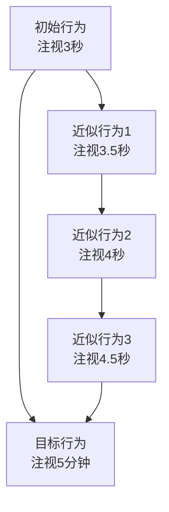

# 儿童专注力训练与心理学原理结合落地方案

> 本方案旨在将心理学理论系统性地转化为可落地的儿童专注力训练产品功能设计，为产品开发提供科学依据与实践指导。

---

## 一、专注力的心理学理论基础

### 1.1 认知心理学：注意的过滤器理论

#### 1.1.1 经典理论模型

| 理论 | 提出者 | 核心观点 | 对专注力训练的启示 |
|------|--------|----------|-------------------|
| **过滤器理论** | Broadbent (1958) | 注意相当于一个过滤器，根据物理特征（声调、位置等）选择性地通过信息 | 训练儿童排除无关刺激的物理干扰能力 |
| **衰减理论** | Treisman (1964) | 未被注意的信息不会完全消失，只是被衰减，在特定条件下可恢复 | 培养儿童对重要信息的"唤醒敏感性" |
| **后期选择理论** | Deutsch & Deutsch (1963) | 所有信息均被加工，选择发生在反应阶段 | 强调工作记忆容量在注意力选择中的重要性 |

#### 1.1.2 资源分配理论

Kahneman (1973) 提出的**注意力资源模型**指出：

- 注意力是有限的心理资源
- 资源分配取决于：
  - 唤醒水平（arousal level）
  - 任务难度
  - 个体当时的意向

**产品设计启示**：

- 训练任务难度需匹配儿童的唤醒水平和能力范围
- 避免在儿童疲劳或过度兴奋时进行高强度训练
- 渐进式增加任务复杂度，维持最佳唤醒状态

### 1.2 发展心理学：不同年龄段注意力发展规律

#### 1.2.1 注意力发展的神经基础

前额叶皮层（Prefrontal Cortex）是执行功能的核心区域，其发育持续到**25岁左右**，但在**7-10岁**期间经历关键成熟期。髓鞘化进程使神经传导效率逐步提升。

#### 1.2.2 各年龄段注意力特征

| 年龄段 | 持续性注意广度 | 分配性注意 | 转移灵活性 | 典型表现 |
|--------|--------------|------------|-----------|---------|
| **3-4岁** | 5-8分钟 | 极低，难以同时关注多个任务 | 差，容易被新奇刺激吸引 | 玩玩具时频繁换新，指令执行困难 |
| **5-6岁** | 10-15分钟 | 初步发展 | 有所改善 | 能完成简单任务但易分心 |
| **7-8岁** | 15-20分钟 | 明显进步 | 逐步发展 | 可进行较复杂任务 |
| **9-12岁** | 20-30分钟 | 基本成熟 | 接近成人水平 | 可进行持续性学习 |

#### 1.2.3 训练目标设定原则

> **维果茨基"最近发展区"理论**提示：训练目标应设定在儿童"现有水平"与"潜在发展水平"之间的区域。

- **3-4岁**：以游戏互动为主，重点培养**注意力的启动和维持**
- **5-6岁**：引入简单任务规则，重点培养**选择性注意**
- **7-8岁**：增加任务复杂度，重点培养**持续性注意和分配性注意**
- **9-12岁**：引入元认知策略，重点培养**注意力的自我调节**

### 1.3 行为主义心理学：学习与强化的基本原理

#### 1.3.1 强化理论（Skinner, 1938）

| 强化类型 | 定义 | 举例 | 在专注力训练中的应用 |
|----------|------|------|---------------------|
| **正强化** | 行为后呈现愉快刺激，增加行为频率 | 完成作业后获得游戏时间 | 完成任务即给予奖励 |
| **负强化** | 行为后移除厌恶刺激，增加行为频率 | 完成整理后取消额外任务 | 完成训练可免除不喜欢的事 |
| **正惩罚** | 行为后呈现厌恶刺激，减少行为频率 | 不推荐使用 | **避免在儿童训练中使用** |
| **负惩罚** | 行为后移除愉快刺激，减少行为频率 | 取消游戏时间 | **谨慎使用，避免抵触** |

#### 1.3.2 塑造与渐进式训练

**塑造（Shaping）**：通过强化逐步接近目标行为的连续近似行为。



#### 1.3.3 强化时间表

| 强化程序 | 定义 | 特点 | 适用场景 |
|----------|------|------|---------|
| **连续强化** (CRF) | 每次正确行为都强化 | 见效快，易消退 | 训练初期、新行为建立 |
| **间隔强化** (Interval) | 按时间间隔强化 | 较抗消退 | 维持行为 |
| **比率强化** (Ratio) | 按行为次数强化 | 效率高 | 行为已稳定后 |
| **变率强化** (VR) | 不固定次数/时间 | 最抗消退 | 长期维持 |

**产品设计建议**：初期采用连续强化，行为稳定后过渡到变率强化，防止奖励依赖。

### 1.4 社会学习理论：观察与榜样

#### 1.4.1 班杜拉的社会学习理论（Bandura, 1977）

核心机制：**观察学习四要素**

1. **注意过程**：观察者对示范行为的觉察
2. **保持过程**：对行为的记忆存储
3. **再现过程**：将记忆转化为行为
4. **动机过程**：是否执行行为的决策

#### 1.4.2 自我效能感理论（Bandura, 1977）

**自我效能感**：个体对自身完成特定任务能力的判断。

其来源（按重要性排序）：

1. **成就经验**（Mastery Experience）：亲身成功体验 — **最重要**
2. **替代经验**（Vicarious Experience）：观察他人成功
3. **言语说服**（Verbal Persuasion）：他人的鼓励与肯定
4. **生理唤醒**（Physiological States）：对情绪状态的解读

**产品设计启示**：

- 提供**适度挑战**的任务，让儿童体验"我做到了"
- 展示**相似榜样**（同龄人）的成功故事
- 家长/小助手给予**具体、正向**的反馈
- 关注儿童训练时的**情绪状态**，避免焦虑干扰

### 1.5 自我决定理论：内在动机的心理学基础

#### 1.5.1 德西与瑞安的自我决定理论（SDT, 1985）

人类具有三种基本心理需求：

| 需求 | 定义 | 支持方式 |
|------|------|---------|
| **自主感** (Autonomy) | 感到行为是自我选择的 | 提供选择权，避免强制 |
| **胜任感** (Competence) | 感到能够胜任任务 | 任务难度匹配，及时反馈 |
| **关联感** (Relatedness) | 感到被关爱和归属 | 建立情感连接，社交互动 |

#### 1.5.2 内在动机与外在动机的转化

```
外在动机 ──────────────────────────────────────> 内在动机
（依赖外部奖励）                               （自我驱动）
    │                                              ▲
    ▼                                              │
[控制型动机] → [认同调节] → [整合调节] ─────────┘
                                             
失去外在强化 → 行为持续           行为成为自我一部分
```

**产品设计启示**：

- 初期可使用**外在奖励**启动行为
- 逐步引入**内在奖励**（成就感、好奇心）
- 避免过度依赖外在奖励，防止"过度理由效应"

---

## 二、心理学在专注力检测中的落地

### 2.1 发展性评估方法

#### 2.1.1 与常模对比的理论基础

发展性评估基于**发展心理学常模**，将个体表现与同龄人群体进行比较。

常用评估工具的心理学基础：

| 工具 | 测量的注意力维度 | 常模类型 |
|------|-----------------|---------|
| **持续性操作测验** (CPT) | 持续性注意、冲动控制 | 反应时间的百分位 |
| ** Stroop 测验** | 选择性注意、抑制控制 | 干扰量常模 |
| **威斯康星卡片分类测验** | 认知灵活性、问题解决 | 正确分类数 |
| **数字广度测验** | 工作记忆、注意分配 | 年龄常模 |

#### 2.1.2 评估结果的心理学解读

**百分位解释框架**：

| 百分位范围 | 解读 | 建议 |
|-----------|------|------|
| ≥ P75 | 高于平均 | 优秀，可提供进阶训练 |
| P25-P75 | 正常范围 | 常规训练即可 |
| P10-P25 | 边缘水平 | 需要关注，可加强训练 |
| < P10 | 显著落后 | 建议寻求专业评估 |

### 2.2 行为观察量表设计

#### 2.2.1 家长版行为观察量表

**理论基础**：Achenbach 儿童行为量表 (CBCL) 的行为维度划分

```
家长版专注力行为观察量表
━━━━━━━━━━━━━━━━━━━━━━━━━━━━━━━━━━━━━━━━━━━━━━
一、持续性注意维度（过去2周）
  □ 能否专注完成一件事（如拼图、画画）？
     - 从不（0）□ 偶尔（1）□ 有时（2）□ 经常（3）□ 总是（4）
  □ 专注时长是否达到年龄预期？
     - 远低于（0）□ 略低于（1）□ 符合（2）□ 超预期（3）
  □ 被外界声音/动静干扰的频率？
     - 频繁（0）□ 有时（1）□ 偶尔（2）□ 很少（3）□ 从不（4）
  
二、选择性注意维度
  □ 在嘈杂环境中能否聚焦目标？
  □ 能否从一项活动顺利转移到另一项？
  □ 被无关刺激吸引后能否自主回归？
  
三、执行功能维度
  □ 是否出现"启动困难"（迟迟不开始）？
  □ 是否出现"计划性差"（做事无章法）？
  □ 能否坚持完成多步骤任务？

四、情绪与行为表现
  □ 专注失败时是否出现明显情绪波动？
  □ 是否对失败表现出强烈的回避倾向？
  □ 是否出现"假装努力"（动作多但效率低）？

评分标准：得分越高，专注力表现越好
总分 < 30：建议专业评估
━━━━━━━━━━━━━━━━━━━━━━━━━━━━━━━━━━━━━━━━━━━━━━
```

#### 2.2.2 教师版行为观察量表

**理论基础**：Conners 教师评定量表的学校适应维度

```
教师版课堂专注力观察量表
━━━━━━━━━━━━━━━━━━━━━━━━━━━━━━━━━━━━━━━━━━━━━━
一、课堂参与维度
  □ 眼神接触：能持续与教师/黑板保持目光接触的时长
  □ 回应频率：主动举手或回应提问的次数
  □ 笔记行为：是否主动记录重要内容
  
二、任务执行维度
  □ 指令理解：一次指令的理解完成率
  □ 独立完成：能否独立完成任务而非频繁求助
  □ 错误类型：粗心错误 vs 理解错误的比例
  
三、同伴互动维度
  □ 课堂互动：与同学的合理互动频率
  □ 干扰行为：对其他同学的干扰程度
  
四、跨情境表现
  □ 不同科目表现是否一致
  □ 静态活动 vs 动态活动的专注差异

【教师补充备注栏】
━━━━━━━━━━━━━━━━━━━━━━━━━━━━━━━━━━━━━━━━━━━━━━
```

### 2.3 生态化评估思路

#### 2.3.1 生态效度理论

Bronfenbrenner 的生态系统理论提示：儿童行为应在自然情境中评估，而非脱离情境的标准化测试。

#### 2.3.2 家庭场景评估维度

| 场景 | 观察指标 | 评估要点 |
|------|---------|---------|
| **做作业** | 启动时间、维持时长、错误率 | 与家长陪伴程度的关系 |
| **游戏** | 沉浸深度、自主探索时间 | 感兴趣 vs 不感兴趣活动的差异 |
| **吃饭** | 是否边吃边玩、能否安静用餐 | 日常生活规律性 |
| **睡前** | 能否独立入睡、睡前活动依赖 | 作息规律性 |

#### 2.3.3 学校场景评估维度

| 场景 | 观察指标 | 评估要点 |
|------|---------|---------|
| **课堂** | 专注时长、眼神跟随、笔记 | 科目难度与专注度的关系 |
| **课间** | 活动转换速度、冲动行为 | 自我调节能力 |
| **考试** | 读题速度、检查习惯、时间管理 | 任务导向的专注力 |

### 2.4 检测结果的心理学解读框架

#### 2.4.1 注意力类型的心理学分类

| 类型 | 核心特征 | 可能原因 | 干预重点 |
|------|---------|---------|---------|
| **注意缺陷型** | 主要表现为注意力不集中 | 神经递质失衡、执行功能弱 | 工作记忆训练、环境管理 |
| **多动/冲动型** | 主要表现为坐不住、冲动 | 唤醒不足、抑制控制弱 | 运动调节、冲动控制训练 |
| **混合型** | 兼具两者特征 | 多因素综合 | 综合干预方案 |

#### 2.4.2 解读报告的心理学框架

```
┌─────────────────────────────────────────────────────────────┐
│                    专注力发展评估报告                          │
├─────────────────────────────────────────────────────────────┤
│ 【 strengths优势发现 】                                     │
│  • 视觉注意力表现良好（P65）                                  │
│  • 对感兴趣的领域能高度专注                                   │
│  → 策略：利用兴趣领域作为训练切入点                           │
├─────────────────────────────────────────────────────────────┤
│ 【 growth areas成长空间 】                                  │
│  • 听觉持续注意偏弱（P32）                                   │
│  • 任务转换灵活性有待提升                                     │
│  → 策略：加强听觉训练和渐进式任务转换练习                      │
├─────────────────────────────────────────────────────────────┤
│ 【 contextual factors情境因素 】                            │
│  • 独处时专注力优于有他人在场时                               │
│  → 策略：初期训练创造相对安静环境，逐步增加社交情境             │
├─────────────────────────────────────────────────────────────┤
│ 【 recommendations行动建议 】                                │
│  • 每日2次，每次10分钟，渐进增加                             │
│  • 家长反馈采用"过程取向"语言                                │
│  • 21天为一个评估周期                                        │
└─────────────────────────────────────────────────────────────┘
```

---

## 三、心理学在专注力训练中的落地

### 3.1 基于行为主义的训练系统设计

#### 3.1.1 代币经济系统设计

**理论基础**：Skinner 的操作性条件反射

```
┌────────────────────────────────────────────────────────────────┐
│                        代币经济系统                              │
├────────────────────────────────────────────────────────────────┤
│ 【代币获取规则】                                                │
│   • 完成基础训练任务 → 获得专注力币 ×1                          │
│   • 连续3天完成训练 → 获得专注力币 ×2（连击奖励）                 │
│   • 训练表现优于昨日 → 获得专注力币 ×1（进步奖励）                │
│   • 主动完成额外任务 → 获得专注力币 ×3（自主奖励）                 │
├────────────────────────────────────────────────────────────────┤
│ 【代币兑换规则】                                                │
│   • 专注力币 ×10 → 解锁新训练道具                               │
│   • 专注力币 ×20 → 解锁新游戏场景                               │
│   • 专注力币 ×50 → 获得"小助手新装扮"                           │
│   • 专注力币 ×100 → 获得"专注小达人"成就                        │
├────────────────────────────────────────────────────────────────┤
│ 【兑换延迟设计】                                                │
│   • 延迟1天兑换：立即可用的道具/装扮                             │
│   • 延迟7天兑换：稀有道具/大成就（需要攒币）                      │
│   目的：培养延迟满足能力，避免即时强化依赖                        │
└────────────────────────────────────────────────────────────────┘
```

#### 3.1.2 强化时间表的渐进式设计

**阶段化强化策略**：

| 训练阶段 | 强化程序 | 频率 | 目标 |
|---------|---------|------|------|
| **第1-7天** | 连续强化 | 每次成功即奖励 | 建立行为模式 |
| **第8-14天** | 比率强化 (VR2) | 每2次成功奖励1次 | 巩固行为 |
| **第15-21天** | 比率强化 (VR4) | 每4次成功奖励1次 | 提高抗挫折能力 |
| **第22天起** | 变率强化 (VR5-10) | 不固定，强化稀缺性 | 长期维持 |

### 3.2 基于自我决定理论的动机激发策略

#### 3.2.1 自主感支持策略

| 设计要素 | 具体做法 | 心理学依据 |
|---------|---------|-----------|
| **选择权** | 允许选择训练顺序/时间 | 自主感 → 内在动机 |
| **参与权** | 参与训练内容决策 |  Ownership感 |
| **节奏权** | 允许暂停和继续 | 控制感 |

**产品功能示例**：

```
┌─────────────────────────────────────────┐
│  今日训练 · 自主选择                     │
├─────────────────────────────────────────┤
│  请选择今天想先做的训练（可多选）：       │
│                                          │
│  [○] 舒尔特方格（5分钟）                 │
│  [○] 听词做动作（7分钟）                 │
│  [○] 记忆翻牌（6分钟）                   │
│                                          │
│  已选：听词做动作 → 开始训练             │
│           ↑ 点击可拖动调整顺序           │
└─────────────────────────────────────────┘
```

#### 3.2.2 胜任感支持策略

| 设计要素 | 具体做法 | 心理学依据 |
|---------|---------|-----------|
| **难度匹配** | 任务难度 = 现有能力 × 1.1 | 最佳唤醒理论 |
| **即时反馈** | 每步操作都有反馈 | 掌控感 |
| **进步可视化** | 成长曲线、对比昨日 | 渐进成功体验 |

#### 3.2.3 关联感支持策略

| 设计要素 | 具体做法 | 心理学依据 |
|---------|---------|-----------|
| **小助手陪伴** | 虚拟角色全程陪伴 | 社会临场感 |
| **家长互动** | 亲子训练任务 | 关系联结 |
| **同伴展示** | 进步故事分享 | 社会比较 |

### 3.3 基于发展心理学的分龄分级训练方案

#### 3.3.1 3-4岁幼儿专注力训练方案

**发展目标**：注意力的启动与初步维持

| 训练名称 | 心理学原理 | 时长 | 频次 |
|---------|-----------|------|------|
| 音乐跟随 | 听觉注意 + 节奏感知 | 3分钟 | 每日2次 |
| 颜色分类 | 视觉注意 + 执行功能 | 5分钟 | 每日1次 |
| 模仿游戏 | 选择性注意 + 工作记忆 | 5分钟 | 每日1次 |
| 静默挑战 | 自我控制 + 延迟满足 | 1分钟 | 每日3次 |

#### 3.3.2 5-6岁学龄前儿童专注力训练方案

**发展目标**：选择性注意与注意维持能力

| 训练名称 | 心理学原理 | 时长 | 频次 |
|---------|-----------|------|------|
| 舒尔特方格（3×3） | 视觉搜索 + 广度 | 5分钟 | 每日1次 |
| 听词做动作 | 听觉注意 + 反应抑制 | 7分钟 | 每日1次 |
| 故事复述 | 听觉记忆 + 复述策略 | 8分钟 | 每日1次 |
| 拼图游戏 | 持续注意 + 问题解决 | 10分钟 | 每日1次 |

#### 3.3.3 7-8岁学龄初期儿童专注力训练方案

**发展目标**：持续性注意与注意分配能力

| 训练名称 | 心理学原理 | 时长 | 频次 |
|---------|-----------|------|------|
| 舒尔特方格（5×5） | 视觉扫描 + 广度 | 8分钟 | 每日1次 |
| 双作业任务 | 注意分配 + 工作记忆 | 10分钟 | 每日1次 |
| 番茄钟专注 | 时间管理 + 自我监控 | 15分钟 | 每日2次 |
| 正念呼吸（简化） | 元认知 + 情绪调节 | 5分钟 | 每日1次 |

#### 3.3.4 9-12岁学龄中期儿童专注力训练方案

**发展目标**：注意力自我调节与元认知

| 训练名称 | 心理学原理 | 时长 | 频次 |
|---------|-----------|------|------|
| 复杂舒尔特 | 视觉搜索 + 认知灵活性 | 10分钟 | 每日1次 |
| Stroop 训练 | 抑制控制 | 10分钟 | 每日1次 |
| 思维导图 | 组织策略 + 工作记忆 | 15分钟 | 每日1次 |
| 冥想训练 | 元认知 + 注意力调节 | 10分钟 | 每日1次 |

### 3.4 基于认知心理学的注意力策略训练

#### 3.4.1 元认知训练框架

**元认知**（Metacognition）：对自身思维过程的认知和调控。

```
┌─────────────────────────────────────────────────────────────────┐
│                      元认知训练四步法                             │
├─────────────────────────────────────────────────────────────────┤
│                                                                 │
│  【第一步：计划】                                                │
│   "今天要完成3个训练，每个大约需要10分钟"                        │
│   → 目标设定、时间规划                                          │
│                                                                 │
│  【第二步：监控】                                                │
│   "我发现自己在第5分钟有点走神，提醒自己拉回来"                   │
│   → 自我观察、即时调整                                          │
│                                                                 │
│  【第三步：评估】                                                │
│   "今天比昨天多坚持了2分钟，进步了！"                           │
│   → 自我评价、原因分析                                          │
│                                                                 │
│  【第四步：反思】                                                │
│   "下次可以试试在更安静的时间段训练"                             │
│   → 策略调整、经验总结                                          │
│                                                                 │
└─────────────────────────────────────────────────────────────────┘
```

#### 3.4.2 自我监控工具设计

```
┌──────────────────────────────────────────────┐
│              我的专注日记                      │
├──────────────────────────────────────────────┤
│  日期：____月____日                            │
│                                              │
│  今天的目标：完成 □ 训练任务                   │
│                                              │
│  专注度自评：                                  │
│  😐 ──── 😠 ──── 😐 ──── 😊 ──── 🤩            │
│  (1)      (2)      (3)      (4)      (5)     │
│                                              │
│  走神次数记录：____次                          │
│                                              │
│  我使用了什么方法让自己专注？                  │
│  □ 深呼吸   □ 倒数   □ 想象成功   □ 其他____   │
│                                              │
│  今天的感悟：________________________________  │
│  ___________________________________________ │
└──────────────────────────────────────────────┘
```

### 3.5 正念训练在儿童专注力中的应用（简化版）

#### 3.5.1 儿童正念训练的理论基础

正念（Mindfulness）源于东方禅修，现代心理学研究证实其可增强注意力调控能力。儿童版正念需简化形式、缩短时长、趣味化呈现。

#### 3.5.2 简化版正念训练方案

| 训练名称 | 引导语 | 时长 | 适用年龄 |
|---------|-------|------|---------|
| **呼吸感知** | "把小手放在肚子上，感受呼吸时肚子的起伏" | 2分钟 | 3-6岁 |
| **身体扫描** | "从头到脚，依次感受每个部位的放松" | 3分钟 | 6-10岁 |
| **五感练习** | "用眼睛找3个红色的东西，用耳朵听2个声音" | 3分钟 | 5-8岁 |
| **泡泡呼吸** | "想象吹泡泡，慢慢地、轻轻地吹" | 2分钟 | 3-6岁 |
| **星星冥想** | "想象自己是一颗星星，安静地发光" | 5分钟 | 6-12岁 |

#### 3.5.3 正念训练产品交互设计

```
┌──────────────────────────────────────────────────────┐
│                                                      │
│              🍃 呼 吸 练 习                           │
│                                                      │
│                    ○                                 │
│                 ○     ○                              │
│              ○              ○                        │
│                 ○        ○                           │
│                    ○                                 │
│                                                      │
│              [可视化呼吸动画]                         │
│                                                      │
│         吸气... ▶▶▶▶▶▶▶▶▶▶▶▶▶▶▶▶▶▶▶▶▶▶▶ 保持         │
│              ◀◀◀◀◀◀◀◀◀◀◀◀◀◀◀◀◀◀◀◀◀◀◀ 呼气         │
│                                                      │
│              小助手：                                │
│         "慢慢吸气，慢慢呼气"                          │
│         "你做得很好，继续专注在呼吸上"                 │
│                                                      │
│                 [ 跳过 ]  [ 完成 ]                    │
└──────────────────────────────────────────────────────┘
```

---

## 四、具体产品落地方案

### 4.1 儿童端激励体系的心理学设计

#### 4.1.1 成就系统的心理学原理

| 成就类型 | 心理学原理 | 设计要点 |
|---------|-----------|---------|
| **里程碑成就** | 目标梯度效应 | 接近目标时动力最强 |
| **连胜成就** | 承诺升级效应 | 利用已投入成本 |
| **稀有成就** | 社会比较 + 稀缺性 | 独家特权感 |
| **协作成就** | 社会助长效应 | 促进社会互动 |

#### 4.1.2 徽章系统的设计规范

| 徽章名称 | 获得条件 | 展示位置 | 心理学价值 |
|---------|---------|---------|-----------|
| 🏆 初次专注 | 完成第一次训练 | 主页展示 | 降低启动门槛 |
| 🔥 连续7天 | 连续打卡7天 | 徽章墙 | 承诺一致性 |
| 🌟 进步之星 | 分数提升20% | 个人主页 | 成长导向 |
| 🎯 完美通关 | 某训练满分 | 成就墙 | 能力证明 |
| 🤝 协作达人 | 完成3次亲子任务 | 社交主页 | 社会联结 |
| 💎 专注达人 | 累计训练100次 | 荣誉殿堂 | 长期坚持 |

#### 4.1.3 等级系统的设计

```
┌────────────────────────────────────────────────────────────┐
│                        等 级 体 系                          │
├────────────────────────────────────────────────────────────┤
│                                                            │
│  【等级设计】                                               │
│  Lv.1 小芽芽  ──→  Lv.5 小树苗  ──→  Lv.10 小花朵          │
│  Lv.15 小星星  ──→  Lv.20 小月亮  ──→  Lv.30 专注太阳      │
│                                                            │
│  【升级机制】                                               │
│  • 经验值来源：完成任务(+10)、达成成就(+30)、坚持打卡(+5)  │
│  • 等级提升解锁：新场景、新道具、新训练内容                 │
│                                                            │
│  【心理学设计依据】                                         │
│  • 阶梯式难度：每级所需经验递增，维持挑战感                 │
│  • 即时反馈：等级提升有专属动画和音效                       │
│  • 社会认可：等级可在社区展示                               │
│                                                            │
└────────────────────────────────────────────────────────────┘
```

### 4.2 小助手情感陪伴的心理学机制

#### 4.2.1 依恋理论在产品中的应用

Bowlby 的依恋理论指出：安全依恋关系提供情感安全感。

| 依恋类型 | 特征 | 产品互动策略 |
|---------|------|-------------|
| **安全型** | 信任、依赖 | 提供稳定的陪伴和及时回应 |
| **焦虑型** | 担心被抛弃 | 强调"我会一直在"的承诺 |
| **回避型** | 情感疏离 | 给予空间，不强制互动 |

**小助手设计原则**：

- 始终在场，但不侵入（提供安全感但不造成压力）
- 表达理解（共情式回应）
- 适度鼓励而非过度表扬

#### 4.2.2 社会支持理论的应用

社会支持（Social Support）可降低压力、提升心理韧性。

| 支持类型 | 产品实现方式 |
|---------|-------------|
| **情感支持** | 小助手表达理解和关心 |
| **信息支持** | 提供训练指导和问题解答 |
| **工具支持** | 提供实用工具（计时器、清单） |
| **评价支持** | 给予正向反馈和鼓励 |

#### 4.2.3 小助手互动话术设计

**【训练前】激励话术**

```
小助手："今天感觉怎么样？准备好开始专注力训练了吗？
         不用担心，我会在旁边陪你哦～"
```

**【训练中】鼓励话术**

```
小助手："你刚才真的很专注！继续保持，你做得很好！"
小助手："没关系，中间有点走神是正常的，
         谢谢你把自己拉回来了，这很厉害哦！"
```

**【训练后】肯定话术**

```
小助手："今天的训练结束了！不管结果怎么样，
         你愿意尝试就是最棒的事情。我们明天见～"
```

### 4.3 家长端反馈话术设计

#### 4.3.1 成长型思维 vs 固定型思维的对比

| 场景 | ❌ 固定型思维话术 | ✅ 成长型思维话术 |
|------|-----------------|------------------|
| **孩子成功时** | "你真聪明！" | "你一定很努力，才会做得这么好！" |
| **孩子失败时** | "你怎么这么笨" | "这次没成功，我们可以从中学到什么？" |
| **孩子想放弃** | "你就是不够专心" | "遇到困难很正常，我们可以一起想办法" |
| **孩子分心** | "你怎么又走神了" | "我注意到你有点分心，需要我帮忙吗？" |

#### 4.3.2 家长反馈话术模板

**日常鼓励模板**：

```
[孩子完成任务后的反馈建议]

"我注意到你今天完成了[具体任务]，比昨天多坚持了[X]分钟！
 这说明你在进步——这就是'成长'。

 你是怎么做到的？" [引导孩子反思]

 [等待孩子回应后]
"看来你找到了自己的方法。继续保持，我们明天见～"
```

**进步肯定模板**：

```
"看看你的进步曲线：从[上周水平]提升到了[这周水平]！
 这不是运气，是因为你每天都在练习。

 专注力就像肌肉，越练越强。你正在让自己变得更强！"
```

**挫折应对模板**：

```
"今天的训练好像不太顺利，你感觉怎么样？

 [等待孩子回应，表达共情]
"我理解，如果事情不顺利会让人有点沮丧。

 重要的是，你今天还是来尝试了——这本身就值得骄傲。
 我们来看看可以怎么调整，明天再试试？"
```

### 4.4 亲子互动训练模块的心理学设计

#### 4.4.1 亲子共同完成任务的价值

- **观察学习**：儿童通过观察父母学习专注行为
- **社会联结**：共享活动增强亲子关系
- **行为示范**：父母展示"专注是什么样子的"

#### 4.4.2 亲子训练任务设计

| 任务名称 | 目标 | 互动方式 | 心理学原理 |
|---------|------|---------|-----------|
| **专注接力赛** | 轮流保持专注 | 家庭成员轮流读词、轮流数数 | 社会助长 |
| **专注家庭时光** | 共同专注 | 全家一起完成一幅画/一个项目 | 集体心流 |
| **专注大侦探** | 寻找隐藏物品 | 家长藏、孩子找；孩子藏、家长找 | 角色互换 |
| **今天我当老师** | 复述学习内容 | 孩子给家长讲解今天学的内容 | 知识输出 |

#### 4.4.3 亲子互动激励机制

```
┌────────────────────────────────────────────────────────────┐
│                   亲子训练激励体系                            │
├────────────────────────────────────────────────────────────┤
│ 【亲子积分】                                                  │
│ • 共同完成任务 → 家庭积分 +10                                │
│ • 连续3天亲子训练 → 家庭积分 +20（连击）                      │
│                                                            │
│ 【家庭积分兑换】                                             │
│ • 50积分：周末"无作业日"特权                                 │
│ • 100积分：选择周末家庭活动                                  │
│ • 200积分：实现一个小愿望（如去公园）                        │
│                                                            │
│ 【专属成就】                                                 │
│ 🏠 温馨家庭：完成首次亲子训练                                 │
│ 👨‍👩‍👧 默契搭档：亲子训练满10次                                  │
│ 💪 最佳拍档：连续21天亲子训练                                 │
└────────────────────────────────────────────────────────────┘
```

### 4.5 行为习惯养成的21天效应应用

#### 4.5.1 21天习惯养成理论溯源

Maxwell Maltz (1960) 在《心理控制论》中提出：行为习惯的形成需要21天的练习。该理论虽后续研究显示时间因人而异（18-254天），但21天作为**心理锚点**仍具实践价值。

#### 4.5.2 21天训练周期设计

```
┌──────────────────────────────────────────────────────────────┐
│                    21天习惯养成计划                            │
├──────────────────────────────────────────────────────────────┤
│                                                              │
│  【第1-7天：刻意行动期】                                      │
│  ▸ 目标：建立行为模式                                        │
│  ▸ 策略：固定时间、固定地点、连续强化                          │
│  ▸ 家长任务：全程陪伴、正向反馈                               │
│  ▸ 预期表现：需要意志力，可能会想放弃                          │
│                                                              │
│  【第8-14天：下意识行动期】                                   │
│  ▸ 目标：减少阻力，形成惯性                                   │
│  ▸ 策略：减少提醒、引入自我监控                               │
│  ▸ 家长任务：适当放手、观察而非控制                            │
│  ▸ 预期表现：开始感觉更自然，但仍需坚持                        │
│                                                              │
│  【第15-21天：自然持续期】                                    │
│  ▸ 目标：成为身份认同的一部分                                 │
│  ▸ 策略：庆祝里程碑、引入下一个目标                            │
│  ▸ 家长任务：肯定坚持、展望未来                                │
│  ▸ 预期表现：内化为习惯，不再需要意志力                        │
│                                                              │
│  【21天后的维护】                                            │
│  ▸ 每周回顾习惯保持情况                                       │
│  ▸ 遇到中断不要自责，从头开始新周期                            │
│  ▸ 逐步扩展到其他习惯领域                                     │
│                                                              │
└──────────────────────────────────────────────────────────────┘
```

#### 4.5.3 21天打卡激励机制

| 打卡天数 | 奖励 | 心理学原理 |
|---------|------|-----------|
| Day 1 | 新手徽章 | 启动效应 |
| Day 3 | 专注力币 ×5 | 快速反馈 |
| Day 7 | 专属道具 | 阶段成就 |
| Day 14 | 进阶徽章 | 承诺升级 |
| Day 21 | 成就解锁 + 家长证书 | 里程碑效应 + 外部认可 |

---

## 五、心理学转化内容

### 5.1 家长端心理学科普文章模板

#### 5.1.1 文章模板一：理论科普型

```
【标题】为什么孩子坐不住？认识儿童注意力的发展规律

【开头引入】
"很多家长抱怨：'我的孩子做什么都三分钟热度，是不是有多动症？'
 实际上，儿童的注意力发展有其自然的规律……"

【正文结构】

一、"坐不住"背后的科学
   - 3-6岁儿童注意力的正常时长（年龄×2-5分钟）
   - 大脑前额叶发育的特点
   - 注意力是"可训练"的能力

二、破坏专注力的"隐形杀手"
   - 过多的选择（玩具太多）
   - 不规律的作息
   - 电子屏幕的过度刺激
   - 家长的"过度关心"（频繁打断）

三、这样做，提升孩子专注力
   - 创造"专注友好"的环境
   - 符合发展阶段的期望
   - 专注力是"练"出来的

【结尾】
"专注力不是天生的特质，而是可以培养的技能。
 理解孩子的发展规律，用科学的方法支持，
 每个孩子都能成为'专注小达人'。"

【互动话题】
"你在培养孩子专注力时，遇到过什么困难？欢迎留言分享～"
```

#### 5.1.2 文章模板二：实操指导型

```
【标题】抓住3个关键期，专注力提升事半功倍

【开头引入】
"专注力培养有黄金期吗？当然有！
 不同年龄段的大脑发展特点不同，
 针对性地训练可以事半功倍……"

【正文结构】

一、0-3岁：感觉统合的关键期
   - 感觉输入是注意力发展的基础
   - 推荐活动：爬行、平衡木、触觉游戏

二、3-6岁：规则意识建立期
   - 从自由探索到有规则的活动
   - 推荐活动：桌面游戏、听故事、简单指令执行

三、6-12岁：执行功能发展期
   - 前额叶快速发展
   - 推荐活动：番茄钟、正念练习、复杂任务

【实操工具包】
提供该年龄段的具体训练建议清单

【结尾】
"了解孩子的发展阶段，给对的支持，
 就是最好的专注力培养。"

【互动话题】
"你的孩子处于哪个阶段？有什么训练困惑？"
```

### 5.2 儿童心理状态识别与应对指南

#### 5.2.1 常见心理状态的识别信号

| 心理状态 | 行为表现信号 | 可能原因 | 家长应对策略 |
|---------|-------------|---------|-------------|
| **正常专注** | 眼神跟随、表情平静、可独立完成 | — | 保持环境 |
| **轻度分心** | 小动作增多、眼神飘忽、偶尔抬头 | 疲劳、兴趣下降 | 短暂休息、调整任务 |
| **明显抵触** | 拖延、抱怨、找借口 | 任务太难/太简单、情绪不佳 | 暂停任务、沟通原因 |
| **焦虑表现** | 紧张、坐立不安、反复确认 | 害怕失败、压力过大 | 情感支持、降低难度 |
| **倦怠表现** | 配合但无动力、机械反应 | 长期高负荷 | 休息、调整期望 |
| **过度兴奋** | 大笑、尖叫、无法安静 | 刺激过度、情绪失控 | 降温、减少刺激 |

#### 5.2.2 心理状态干预方案

**场景一：孩子说"我不想做了"**

```
【识别】判断是疲惫型抵触 vs 挫折型抵触 vs 逃避型抵触

【疲惫型应对】
"你听起来有点累了。我们休息5分钟，喝点水，
 休息好了再继续，好吗？"

【挫折型应对】
"这道题有点难，你觉得哪里卡住了？
 要不要我们一起看看？"

【逃避型应对】
"我注意到你好像不太想开始。
 告诉我你在想什么，我们可以想办法。"
```

**场景二：孩子出现明显的挫败情绪**

```
【第一步：情绪确认】
"我看到你有点沮丧/伤心。遇到困难有这些感觉是正常的。"

【第二步：情绪接纳】
"没关系的，每个人都会有这样的时刻。"

【第三步：重新框架】
"这说明你在努力，对吗？
 困难意味着你在挑战自己，这其实是一件好事。"

【第四步：共同解决】
"我们可以怎么做？要不要休息一下再试，
 还是先换个任务？"
```

### 5.3 常见行为问题的心理学干预方案

#### 5.3.1 问题一：训练时频繁走神

**行为功能分析**：

| 可能原因 | 识别信号 | 干预策略 |
|---------|---------|---------|
| 任务太简单 | 完成后无聊 | 提高难度 |
| 任务太难 | 回避行为增加 | 降低难度、增加支持 |
| 环境干扰 | 眼神追随外界刺激 | 减少干扰源 |
| 生理需求 | 揉眼、打哈欠 | 休息、补充能量 |
| 情绪问题 | 情绪波动、叹气 | 情感支持、调节情绪 |

**综合干预方案**：

1. **环境管理**：创造低干扰的训练环境
2. **任务设计**：匹配孩子当前能力
3. **强化策略**：对专注时刻给予即时反馈
4. **渐进训练**：逐步延长专注时间
5. **自我监控**：教会孩子识别"走神信号"

#### 5.3.2 问题二：三分钟热度，难以坚持

**动机分析框架**：

```
┌─────────────────────────────────────────────────────┐
│              坚持不下去？检查这三点！                  │
├─────────────────────────────────────────────────────┤
│                                                     │
│  【动机层面】                                        │
│  孩子为什么愿意做这件事？                             │
│  • 外部奖励？→ 可能难以持续                          │
│  • 内在兴趣？→ 更容易坚持                            │
│  → 策略：发现兴趣点，建立内在联结                     │
│                                                     │
│  【能力层面】                                        │
│  任务难度是否合适？                                   │
│  • 太难 → 挫败感                                     │
│  • 太简单 → 无聊感                                   │
│  • 略难 → 心流体验                                   │
│  → 策略：保持"最近发展区"难度                        │
│                                                     │
│  【关系层面】                                        │
│  做这件事的体验感如何？                               │
│  • 被批评多 → 逃避                                  │
│  • 被肯定多 → 愿意继续                              │
│  → 策略：多肯定过程，少评价结果                       │
│                                                     │
└─────────────────────────────────────────────────────┘
```

**具体干预措施**：

1. **降低启动门槛**：从"只做1分钟"开始
2. **即时强化**：完成任务立即给予正向反馈
3. **进度可视化**：让孩子看到自己的进步曲线
4. **选择权**：允许选择训练内容和时间
5. **社会联结**：邀请家长陪伴或同伴互动

#### 5.3.3 问题三：对训练产生抵触情绪

**情绪ABC理论的干预应用**：

| 要素 | 说明 | 应用示例 |
|------|------|---------|
| **A (Antecedent)** | 前因事件 | "妈妈说要练专注力了" |
| **B (Belief)** | 信念解读 | "练专注力很无聊/很痛苦/我做不到" |
| **C (Consequence)** | 行为结果 | 抵触、哭闹、逃避 |

**干预策略**：

1. **识别信念**："我注意到你好像不太开心，能告诉我你在想什么吗？"
2. **挑战信念**："真的吗？练专注力一定很无聊吗？上次你不是……"
3. **重建关联**：将训练与积极体验联结
4. **调整环境**：改变训练的场景和方式
5. **循序渐进**：从孩子愿意做的事情开始

---

## 附录：理论参考文献

| 理论 | 主要参考文献 |
|------|-------------|
| 注意力过滤器理论 | Broadbent, D. E. (1958). Perception and Communication |
| 衰减理论 | Treisman, A. M. (1960). Contextual cues in selective listening |
| 强化理论 | Skinner, B. F. (1938). The Behavior of Organisms |
| 社会学习理论 | Bandura, A. (1977). Social Learning Theory |
| 自我效能感 | Bandura, A. (1977). Self-efficacy: Toward a unifying theory... |
| 自我决定理论 | Deci, E. L., & Ryan, R. M. (1985). Intrinsic Motivation and Self-Determination |
| 生态系统理论 | Bronfenbrenner, U. (1979). The Ecology of Human Development |
| 21天习惯理论 | Maltz, M. (1960). Psycho-Cybernetics |
| 正念与注意力 | Bishop, S. R., et al. (2004). Mindfulness: A proposed operational definition |
| 儿童发展常模 | American Psychological Association. Developmental milestones |

---

> **文档版本**：v1.0  
> **适用范围**：儿童专注力训练产品设计与心理学应用指导  
> **使用建议**：本方案为理论框架，具体产品落地需根据目标用户群体特征、产品定位及可用资源进行适当调整。方案中涉及心理评估的内容，仅供产品功能设计参考，不替代专业心理诊断。
