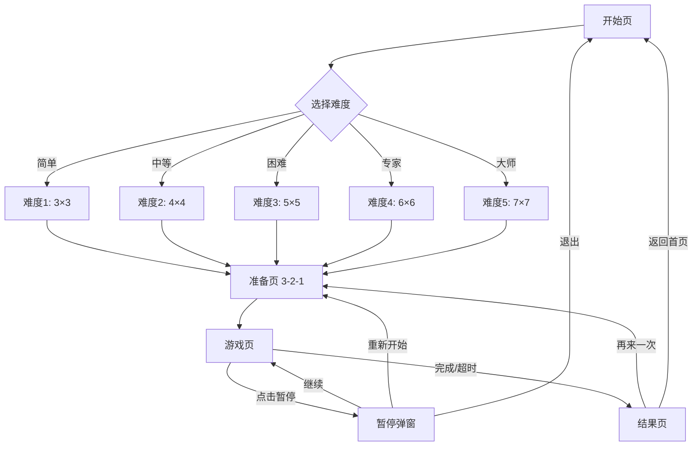

# 儿童专注力训练 - 游戏01舒尔特方格开发设计文档

## 文档信息

| 项目 | 内容 |
|------|------|
| 游戏编号 | 游戏01 |
| 游戏名称 | 舒尔特方格 (Schulte Table) |
| 游戏类型 | 视觉专注力训练 |
| 目标年龄段 | 4-12岁 |
| 优先级 | P0 |

---

## 目录

1. [游戏概述](#1-游戏概述)
2. [页面结构设计](#2-页面结构设计)
3. [组件设计](#3-组件设计)
4. [状态管理设计](#4-状态管理设计)
5. [数据记录指标设计](#5-数据记录指标设计)
6. [技术实现要点](#6-技术实现要点)
7. [数据库表设计](#7-数据库表设计)

---

## 1. 游戏概述

### 1.1 游戏规则

舒尔特方格是经典的视觉注意力训练工具，通过在方格中寻找并按顺序点击数字来训练视觉扫描能力和专注力。

**核心玩法：**
- 屏幕上显示一个 N×N 的方格，每个格子中有1到N²的数字
- 玩家需要按照从小到大的顺序依次点击所有数字
- 计时结束后，根据完成时间和正确率计算得分

### 1.2 难度配置

```typescript
interface SchulteDifficulty {
  level: number;           // 难度等级 1-5
  gridSize: number;        // 方格大小 3×3, 4×4, 5×5, 6×6, 7×7
  timeLimit: number;       // 时间限制(秒)
  showTimer: boolean;      // 是否显示倒计时
  allowErrors: boolean;    // 是否允许错误点击
  maxErrors: number;       // 最大错误次数（0表示不允许）
}

const SCHULTE_DIFFICULTY_CONFIG = {
  // 等级1: 3×3，适合4-5岁初学者
  level_1: {
    gridSize: 3,
    timeLimit: 45,
    showTimer: true,
    allowErrors: true,
    maxErrors: 5,
    numberRange: [1, 9],
    gridGap: 8,
    cellSize: 80,
  },
  
  // 等级2: 4×4，适合5-6岁
  level_2: {
    gridSize: 4,
    timeLimit: 60,
    showTimer: true,
    allowErrors: true,
    maxErrors: 3,
    numberRange: [1, 16],
    gridGap: 6,
    cellSize: 70,
  },
  
  // 等级3: 5×5，适合6-8岁
  level_3: {
    gridSize: 5,
    timeLimit: 90,
    showTimer: true,
    allowErrors: true,
    maxErrors: 2,
    numberRange: [1, 25],
    gridGap: 4,
    cellSize: 60,
  },
  
  // 等级4: 6×6，适合8-10岁
  level_4: {
    gridSize: 6,
    timeLimit: 120,
    showTimer: true,
    allowErrors: true,
    maxErrors: 2,
    numberRange: [1, 36],
    gridGap: 4,
    cellSize: 52,
  },
  
  // 等级5: 7×7，适合10-12岁
  level_5: {
    gridSize: 7,
    timeLimit: 150,
    showTimer: true,
    allowErrors: false,
    maxErrors: 0,
    numberRange: [1, 49],
    gridGap: 3,
    cellSize: 44,
  },
};
```

### 1.3 评分算法

```typescript
// 得分计算
function calculateScore(params: {
  correctCount: number;      // 正确点击次数
  errorCount: number;       // 错误点击次数
  totalNumbers: number;      // 总数字数量
  timeSpent: number;        // 花费时间(秒)
  timeLimit: number;        // 时间限制(秒)
  difficultyLevel: number;  // 难度等级
}): number {
  const { correctCount, errorCount, totalNumbers, timeSpent, timeLimit, difficultyLevel } = params;
  
  // 基础分 = 正确数量 × 10
  const baseScore = correctCount * 10;
  
  // 完成奖励（全部完成才给予）
  const completionBonus = correctCount === totalNumbers ? 50 : 0;
  
  // 准确率系数 = 正确次数 / (正确次数 + 错误次数)
  const accuracyRate = correctCount / (correctCount + errorCount || 1);
  
  // 时间系数 = 剩余时间比例（越快越好）
  const timeRatio = Math.max(0, (timeLimit - timeSpent) / timeLimit);
  
  // 难度系数 = 难度等级 × 0.2 + 0.4
  const difficultyFactor = difficultyLevel * 0.2 + 0.4;
  
  // 最终得分
  const finalScore = Math.round(
    (baseScore + completionBonus) * accuracyRate * (1 + timeRatio) * difficultyFactor
  );
  
  return Math.min(finalScore, 999); // 最高999分
}

// 星星计算
function calculateStars(score: number, difficultyLevel: number): number {
  const thresholds = {
    1: [30, 60, 90],    // 等级1: 1星30分, 2星60分, 3星90分
    2: [40, 70, 100],   // 等级2
    3: [50, 80, 120],   // 等级3
    4: [60, 100, 150],  // 等级4
    5: [80, 130, 200],  // 等级5
  };
  
  const levelThresholds = thresholds[difficultyLevel as keyof typeof thresholds];
  
  if (score >= levelThresholds[2]) return 3;
  if (score >= levelThresholds[1]) return 2;
  if (score >= levelThresholds[0]) return 1;
  return 0;
}
```

---

## 2. 页面结构设计

### 2.1 页面列表

| 页面名称 | 路由 | 功能描述 |
|----------|------|----------|
| 舒尔特开始页 | /game/schulte/start | 展示游戏说明、难度选择、开始按钮 |
| 舒尔特准备页 | /game/schulte/ready | 3-2-1倒计时准备 |
| 舒尔特游戏页 | /game/schulte/play | 游戏进行中 |
| 舒尔特暂停页 | /game/schulte/pause | 暂停弹窗 |
| 舒尔特结果页 | /game/schulte/result | 展示成绩、星星、奖励 |

### 2.2 页面流程图



### 2.3 各页面功能说明

#### 2.3.1 开始页 (Start)

**功能：**
- 展示游戏名称、图标、简要说明
- 显示历史最佳成绩
- 难度选择（5个等级）
- 开始游戏按钮
- 返回按钮

**布局要素：**
```
┌────────────────────────────────────────┐
│ ← 返回              舒尔特方格         │
├────────────────────────────────────────┤
│                                        │
│         [游戏图标/动画]                 │
│                                        │
│    "在方格中按顺序点击数字"             │
│                                        │
│   ┌────────────────────────────────┐   │
│   │  🏆 历史最佳                    │   │
│   │  得分: 156分  用时: 42秒        │   │
│   └────────────────────────────────┘   │
│                                        │
│   选择难度:                            │
│   ○ 简单 (3×3)  - 4-5岁              │
│   ● 中等 (4×4)  - 5-6岁  ✓推荐       │
│   ○ 困难 (5×5)  - 6-8岁              │
│   ○ 专家 (6×6)  - 8-10岁             │
│   ○ 大师 (7×7)  - 10-12岁             │
│                                        │
│   ┌────────────────────────────────┐   │
│   │                                │   │
│   │         开始游戏                │   │
│   │                                │   │
│   └────────────────────────────────┘   │
│                                        │
└────────────────────────────────────────┘
```

#### 2.3.2 准备页 (Ready)

**功能：**
- 显示即将开始的难度配置
- 3-2-1倒计时动画
- 倒计时结束后自动进入游戏

**交互流程：**
```
显示"准备好了吗？" (1s)
     ↓
显示"3" 大字动画 (1s)
     ↓
显示"2" 大字动画 (1s)
     ↓
显示"1" 大字动画 (1s)
     ↓
显示"开始！" (0.5s)
     ↓
进入游戏页
```

#### 2.3.3 游戏页 (Play)

**功能：**
- 显示方格矩阵
- 显示当前目标数字
- 显示计时器
- 显示正确/错误计数
- 暂停按钮

**布局要素：**
```
┌────────────────────────────────────────┐
│ ← 返回        ⏱️ 01:23        ⏸️暂停  │
├────────────────────────────────────────┤
│                                        │
│        🔍 找到: [15]                   │
│                                        │
│   ┌────┬────┬────┬────┬────┐        │
│   │  3 │ 17 │  8 │ 22 │  1 │        │
│   ├────┼────┼────┼────┼────┤        │
│   │ 11 │  5 │ 25 │ 14 │ 19 │        │
│   ├────┼────┼────┼────┼────┤        │
│   │  7 │ 21 │  9 │  4 │ 16 │        │
│   ├────┼────┼────┼────┼────┤        │
│   │ 24 │ 12 │  6 │ 20 │ 10 │        │
│   ├────┼────┼────┼────┼────┤        │
│   │ 15 │  2 │ 18 │ 23 │ 13 │        │
│   └────┴────┴────┴────┴────┘        │
│                                        │
│   ✅ 正确: 14    ❌ 错误: 2           │
│                                        │
└────────────────────────────────────────┘
```

#### 2.3.4 暂停弹窗 (Pause Modal)

**触发条件：** 点击暂停按钮

**功能：**
- 显示当前进度（已点击/总数）
- 继续游戏
- 重新开始
- 退出游戏

#### 2.3.5 结果页 (Result)

**功能：**
- 星星展示动画
- 得分展示
- 用时、正确率统计
- 经验值获得
- 成就解锁提示（如有）
- 再来一次 / 返回首页

---

## 3. 组件设计

### 3.1 可复用组件列表

| 组件名 | 说明 | 复用范围 |
|--------|------|----------|
| SchulteGrid | 方格矩阵组件 | 仅本游戏 |
| SchulteCell | 单个方格组件 | 仅本游戏 |
| DifficultySelector | 难度选择器 | 通用 |
| CountdownTimer | 倒计时组件 | 通用 |
| GameTimer | 游戏计时器 | 通用 |
| StatsBar | 统计栏(正确/错误) | 通用 |
| PauseModal | 暂停弹窗 | 通用 |
| ResultModal | 结果弹窗 | 通用 |

### 3.2 SchulteGrid 组件

```typescript
interface SchulteGridProps {
  gridSize: number;              // 方格大小 3-7
  numbers: number[];             // 打乱后的数字数组
  foundNumbers: number[];         // 已找到的数字数组
  currentTarget: number;          // 当前目标数字
  cellSize: number;              // 单元格大小(dp)
  gridGap: number;               // 格子间距(dp)
  onCellPress: (number: number) => void; // 点击回调
  disabled?: boolean;            // 是否禁用
  showNumberHints?: boolean;     // 是否显示数字提示
}

// 状态
interface SchulteGridState {
  numbers: number[];              // 数字数组
  foundNumbers: Set<number>;       // 已找到数字集合
  currentTarget: number;          // 当前目标
  lastClickedCell: number | null; // 上次点击的格子索引
  clickAnimation: 'correct' | 'wrong' | null; // 点击动画状态
}

// 内部实现
// - 根据 gridSize 生成长宽
// - 使用 Fisher-Yates 洗牌算法生成随机数字排列
// - 渲染 N×N 的 Cell 网格
// - 每个 Cell 根据状态显示不同样式
```

### 3.3 SchulteCell 组件

```typescript
interface SchulteCellProps {
  number: number;                // 单元格数字
  status: 'default' | 'current' | 'found' | 'wrong'; // 状态
  size: number;                  // 单元格大小
  onPress: () => void;          // 点击回调
  animationState?: 'idle' | 'pulse' | 'success' | 'error'; // 动画状态
}

// 状态样式
const CELL_STYLES = {
  default: {
    backgroundColor: '#FFFFFF',
    borderColor: '#E0E0E0',
    textColor: '#333333',
  },
  current: {
    backgroundColor: '#6C63FF',
    borderColor: '#6C63FF',
    textColor: '#FFFFFF',
  },
  found: {
    backgroundColor: '#6BCB77',
    borderColor: '#6BCB77',
    textColor: '#FFFFFF',
  },
  wrong: {
    backgroundColor: '#FF8A80',
    borderColor: '#FF8A80',
    textColor: '#FFFFFF',
  },
};

// 动画效果
const CELL_ANIMATIONS = {
  pulse: {
    duration: 800,
    easing: 'ease-in-out',
    effect: 'scale(1.05) opacity(0.8)',
  },
  success: {
    duration: 300,
    easing: 'ease-out',
    effect: 'scale(1.1) → scale(1)',
  },
  error: {
    duration: 200,
    easing: 'ease-out',
    effect: 'shake',
  },
};
```

### 3.4 DifficultySelector 组件

```typescript
interface DifficultySelectorProps {
  levels: DifficultyOption[];    // 难度选项列表
  selectedLevel: number;         // 选中的难度
  onSelect: (level: number) => void; // 选择回调
  recommendedLevel?: number;     // 推荐难度
}

interface DifficultyOption {
  level: number;
  name: string;                 // 简单/中等/困难等
  description: string;           // 描述
  gridSize: number;             // 方格大小
  ageRange?: string;             // 推荐年龄
  isLocked?: boolean;            // 是否锁定
}

// 使用示例
const difficultyOptions = [
  { level: 1, name: '简单', description: '3×3方格', gridSize: 3, ageRange: '4-5岁' },
  { level: 2, name: '中等', description: '4×4方格', gridSize: 4, ageRange: '5-6岁', recommended: true },
  { level: 3, name: '困难', description: '5×5方格', gridSize: 5, ageRange: '6-8岁' },
  { level: 4, name: '专家', description: '6×6方格', gridSize: 6, ageRange: '8-10岁' },
  { level: 5, name: '大师', description: '7×7方格', gridSize: 7, ageRange: '10-12岁' },
];
```

### 3.5 CountdownTimer 组件

```typescript
interface CountdownTimerProps {
  startCount?: number;           // 开始倒数数字，默认3
  onCountChange?: (count: number) => void; // 数字变化回调
  onComplete?: () => void;       // 倒计时完成回调
  textStyle?: TextStyle;         // 文字样式
  animationStyle?: 'scale' | 'fade' | 'slide'; // 动画风格
}

// 状态机
type CountdownState = 'ready' | 'counting' | 'complete';
```

### 3.6 StatsBar 组件

```typescript
interface StatsBarProps {
  correctCount: number;          // 正确次数
  errorCount: number;            // 错误次数
  totalCount: number;            // 总数
  showProgress?: boolean;        // 是否显示进度
  layout?: 'horizontal' | 'vertical'; // 布局方向
}

// 样式配置
const STATS_BAR_CONFIG = {
  correctColor: '#6BCB77',       // 正确绿色
  errorColor: '#FF8A80',         // 错误红色
  textColor: '#333333',
  iconSize: 20,
  textSize: 16,
  spacing: 24,
};
```

### 3.7 PauseModal 组件

```typescript
interface PauseModalProps {
  visible: boolean;              // 是否显示
  currentProgress: {
    foundCount: number;          // 已完成数
    totalCount: number;          // 总数
    timeSpent: number;           // 已用时间
  };
  onResume: () => void;          // 继续
  onRestart: () => void;         // 重新开始
  onQuit: () => void;            // 退出
}

// 按钮配置
const PAUSE_MODAL_BUTTONS = [
  { key: 'resume', text: '继续游戏', icon: '▶️', color: '#6C63FF' },
  { key: 'restart', text: '重新开始', icon: '🔄', color: '#FF9F45' },
  { key: 'quit', text: '退出游戏', icon: '🚪', color: '#9E9E9E' },
];
```

### 3.8 ResultModal 组件

```typescript
interface ResultModalProps {
  visible: boolean;              // 是否显示
  result: {
    stars: number;               // 星星数 0-3
    score: number;               // 得分
    timeSpent: number;            // 用时(秒)
    correctCount: number;         // 正确次数
    errorCount: number;           // 错误次数
    accuracy: number;             // 准确率
    experienceGained: number;    // 获得经验
    newAchievements?: string[];   // 新成就
    isNewBest?: boolean;          // 是否刷新最佳
  };
  onReplay: () => void;          // 再来一次
  onGoHome: () => void;          // 返回首页
  onShare?: () => void;          // 分享（可选）
}

// 动画序列
const RESULT_ANIMATIONS = [
  { delay: 0, element: 'stars', animation: 'sequentialFadeIn', duration: 600 },
  { delay: 800, element: 'score', animation: 'countUp', duration: 1000 },
  { delay: 1900, element: 'stats', animation: 'slideUp', duration: 400 },
  { delay: 2400, element: 'experience', animation: 'bounce', duration: 500 },
  { delay: 3000, element: 'buttons', animation: 'fadeIn', duration: 300 },
];
```

---

## 4. 状态管理设计

### 4.1 游戏核心状态数据结构

```typescript
// 舒尔特方格游戏状态
interface SchulteGameState {
  // 游戏基本信息
  gameId: string;                // 游戏实例ID (UUID)
  gameCode: 'schulte';           // 游戏代码
  
  // 难度配置
  difficulty: {
    level: number;               // 难度等级 1-5
    gridSize: number;            // 方格大小
    timeLimit: number;           // 时间限制
    maxErrors: number;           // 最大错误次数
  };
  
  // 游戏进度
  progress: {
    numbers: number[];           // 打乱后的数字数组
    foundNumbers: number[];      // 已找到的数字列表
    currentTarget: number;       // 当前目标数字
    correctCount: number;        // 正确次数
    errorCount: number;         // 错误次数
    startTime: number;          // 开始时间戳
    elapsedTime: number;        // 已用时间(秒)
  };
  
  // 游戏状态
  status: 'idle' | 'ready' | 'playing' | 'paused' | 'completed' | 'timeout';
  
  // 结果数据
  result: {
    stars: number;               // 星星数
    score: number;              // 得分
    accuracy: number;           // 准确率
    isNewBest: boolean;         // 是否刷新最佳
  } | null;
  
  // 历史记录（用于撤销/重试）
  history: {
    action: 'correct' | 'wrong';
    number: number;
    timestamp: number;
  }[];
}

// 状态机转换
const GAME_STATE_MACHINE = {
  idle: ['ready'],
  ready: ['playing', 'idle'],
  playing: ['paused', 'completed', 'timeout'],
  paused: ['playing', 'ready', 'idle'],
  completed: ['ready', 'idle'],
  timeout: ['ready', 'idle'],
};
```

### 4.2 状态流转逻辑

```typescript
// 状态流转伪代码
class SchulteGameEngine {
  private state: SchulteGameState;
  
  // 开始游戏
  startGame(difficultyLevel: number) {
    this.state.status = 'ready';
    this.state.difficulty = this.getDifficultyConfig(difficultyLevel);
    this.state.progress = this.initProgress();
    this.state.history = [];
    
    // 3秒后自动开始
    setTimeout(() => {
      this.state.status = 'playing';
      this.state.progress.startTime = Date.now();
      this.startTimer();
    }, 3000);
  }
  
  // 处理格子点击
  handleCellPress(number: number) {
    if (this.state.status !== 'playing') return;
    
    const isCorrect = number === this.state.progress.currentTarget;
    
    // 记录历史
    this.state.history.push({
      action: isCorrect ? 'correct' : 'wrong',
      number,
      timestamp: Date.now(),
    });
    
    if (isCorrect) {
      // 正确处理
      this.state.progress.correctCount++;
      this.state.progress.foundNumbers.push(number);
      this.state.progress.currentTarget++;
      
      // 检查是否完成
      if (this.state.progress.currentTarget > this.state.difficulty.gridSize ** 2) {
        this.completeGame();
      }
    } else {
      // 错误处理
      this.state.progress.errorCount++;
      
      // 检查是否超过最大错误次数
      if (this.state.progress.errorCount >= this.state.difficulty.maxErrors) {
        this.timeoutGame('too_many_errors');
      }
    }
    
    // 更新本地存储
    this.saveProgress();
  }
  
  // 暂停游戏
  pauseGame() {
    if (this.state.status === 'playing') {
      this.state.status = 'paused';
      this.state.progress.elapsedTime = this.getElapsedTime();
      this.stopTimer();
    }
  }
  
  // 继续游戏
  resumeGame() {
    if (this.state.status === 'paused') {
      this.state.status = 'playing';
      this.state.progress.startTime = Date.now() - this.state.progress.elapsedTime * 1000;
      this.startTimer();
    }
  }
  
  // 完成游戏
  completeGame() {
    this.state.status = 'completed';
    this.stopTimer();
    
    // 计算结果
    this.state.result = this.calculateResult();
    
    // 保存成绩
    this.saveResult();
  }
  
  // 超时
  timeoutGame(reason: string) {
    this.state.status = 'timeout';
    this.stopTimer();
    this.state.result = this.calculateResult();
    this.saveResult();
  }
}
```

### 4.3 本地存储方案

```typescript
// LocalStorage Key
const SCHULTE_STORAGE_KEYS = {
  PROGRESS: 'schulte_progress',     // 当前进度
  HISTORY: 'schulte_history',       // 历史记录
  BEST_SCORE: 'schulte_best_score', // 最佳成绩
  SETTINGS: 'schulte_settings',    // 设置
};

// 保存当前进度
function saveProgress(state: SchulteGameState) {
  const data = {
    gameId: state.gameId,
    difficulty: state.difficulty,
    progress: state.progress,
    status: state.status,
    savedAt: Date.now(),
  };
  localStorage.setItem(SCHULTE_STORAGE_KEYS.PROGRESS, JSON.stringify(data));
}

// 恢复进度
function loadProgress(): SchulteGameState | null {
  const saved = localStorage.getItem(SCHULTE_STORAGE_KEYS.PROGRESS);
  if (!saved) return null;
  
  const data = JSON.parse(saved);
  
  // 检查是否过期（30分钟内）
  if (Date.now() - data.savedAt > 30 * 60 * 1000) {
    localStorage.removeItem(SCHULTE_STORAGE_KEYS.PROGRESS);
    return null;
  }
  
  return data as SchulteGameState;
}

// 保存最佳成绩
function saveBestScore(score: number, metadata: {
  difficultyLevel: number;
  timeSpent: number;
  correctCount: number;
  errorCount: number;
}) {
  const current = getBestScore();
  
  if (!current || score > current.score) {
    const newBest = {
      score,
      ...metadata,
      achievedAt: Date.now(),
    };
    localStorage.setItem(SCHULTE_STORAGE_KEYS.BEST_SCORE, JSON.stringify(newBest));
    return true; // 新的最佳成绩
  }
  
  return false;
}

// 获取最佳成绩
function getBestScore(): {
  score: number;
  difficultyLevel: number;
  timeSpent: number;
  achievedAt: number;
} | null {
  const saved = localStorage.getItem(SCHULTE_STORAGE_KEYS.BEST_SCORE);
  return saved ? JSON.parse(saved) : null;
}

// 清除所有本地数据
function clearAllData() {
  Object.values(SCHULTE_STORAGE_KEYS).forEach(key => {
    localStorage.removeItem(key);
  });
}
```

---

## 5. 数据记录指标设计

### 5.1 基础数据字段

```typescript
// 舒尔特方格游戏数据
interface SchulteGameData {
  // ========== 基础信息 ==========
  recordId: string;              // 记录ID (UUID)
  childId: string;              // 儿童ID
  gameId: string;               // 游戏配置ID
  gameCode: 'schulte';          // 游戏代码
  
  // ========== 游戏配置 ==========
  config: {
    difficultyLevel: number;    // 难度等级 1-5
    gridSize: number;           // 方格大小
    timeLimit: number;          // 时间限制(秒)
    maxErrors: number;          // 最大错误次数
  };
  
  // ========== 游戏过程数据 ==========
  gameplay: {
    startTime: string;          // 开始时间 ISO8601
    endTime: string;            // 结束时间 ISO8601
    durationSeconds: number;    // 游戏时长(秒)
    
    totalNumbers: number;       // 总数字数量
    correctCount: number;       // 正确次数
    errorCount: number;         // 错误次数
    accuracy: number;           // 准确率 (0-100)
    
    completionStatus: 'completed' | 'timeout' | 'abandoned';
    completionReason?: string;  // 完成原因
  };
  
  // ========== 结果数据 ==========
  result: {
    score: number;              // 得分
    stars: number;              // 星星数 0-3
    isNewBest: boolean;         // 是否刷新最佳
    
    // 评分因子
    scoreFactors: {
      baseScore: number;        // 基础分
      accuracyBonus: number;    // 准确率奖励
      speedBonus: number;       // 速度奖励
      difficultyBonus: number;  // 难度奖励
    };
  };
  
  // ========== 详细操作数据 ==========
  operations: OperationRecord[]; // 操作记录
  
  // ========== 获得奖励 ==========
  rewards: {
    experienceGained: number;   // 获得经验
    achievementsUnlocked: string[]; // 解锁的成就
  };
  
  // ========== 元数据 ==========
  metadata: {
    deviceInfo: string;         // 设备信息
    appVersion: string;         // App版本
    platform: string;           // 平台
    sessionId: string;          // 会话ID
  };
  
  createdAt: string;            // 记录创建时间
}

// 单次操作记录
interface OperationRecord {
  timestamp: number;            // 操作时间戳(相对游戏开始)
  action: 'click' | 'pause' | 'resume' | 'timeout';
  targetNumber: number;         // 点击的数字
  expectedNumber: number;        // 期望的数字
  isCorrect: boolean;           // 是否正确
  timeSinceStart: number;       // 距开始时间(毫秒)
  cellPosition?: {             // 格子位置（可选，用于分析）
    row: number;
    col: number;
  };
}
```

### 5.2 数据上报时机

```typescript
// 数据上报时机定义
const SCHULTE_REPORT_TIMING = {
  // 游戏开始时
  onGameStart: {
    eventName: 'schulte_game_start',
    data: {
      gameId: true,
      config: true,
      childId: true,
      sessionId: true,
    },
    reportType: 'event',
  },
  
  // 每次点击时
  onCellClick: {
    eventName: 'schulte_cell_click',
    data: {
      targetNumber: true,
      isCorrect: true,
      timeSinceStart: true,
      correctCount: true,
      errorCount: true,
    },
    reportType: 'batch',  // 批量上报，降低频率
    batchInterval: 5000, // 5秒批量一次
  },
  
  // 暂停/继续时
  onPauseResume: {
    eventName: 'schulte_pause_resume',
    data: {
      action: true,
      elapsedTime: true,
    },
    reportType: 'event',
  },
  
  // 游戏结束时
  onGameEnd: {
    eventName: 'schulte_game_end',
    data: {
      completionStatus: true,
      durationSeconds: true,
      correctCount: true,
      errorCount: true,
      accuracy: true,
      score: true,
      stars: true,
    },
    reportType: 'event',
  },
  
  // 完整数据上报（游戏结束后）
  onGameComplete: {
    eventName: 'schulte_game_complete',
    data: 'full',  // 完整数据
    reportType: 'final',
  },
};

// 上报服务
class SchulteReportService {
  private batchBuffer: OperationRecord[] = [];
  private batchTimer: number | null = null;
  
  // 初始化上报
  init(childId: string) {
    this.childId = childId;
    this.startBatchTimer();
  }
  
  // 记录操作（批量）
  recordOperation(op: OperationRecord) {
    this.batchBuffer.push(op);
  }
  
  // 批量上报定时器
  private startBatchTimer() {
    this.batchTimer = window.setInterval(() => {
      if (this.batchBuffer.length > 0) {
        this.flushBatch();
      }
    }, SCHULTE_REPORT_TIMING.onCellClick.batchInterval);
  }
  
  // 刷新缓冲区
  private flushBatch() {
    if (this.batchBuffer.length === 0) return;
    
    const data = {
      gameId: this.gameId,
      operations: [...this.batchBuffer],
      timestamp: Date.now(),
    };
    
    // 上报数据
    reportService.send('schulte_cell_click_batch', data);
    
    // 清空缓冲区
    this.batchBuffer = [];
  }
  
  // 游戏结束时上报完整数据
  reportGameComplete(gameData: SchulteGameData) {
    // 先刷新缓冲区
    this.flushBatch();
    
    // 上报完整数据
    reportService.send('schulte_game_complete', gameData);
  }
}
```

### 5.3 数据持久化方案

```typescript
// 客户端数据持久化
class SchulteDataPersistence {
  private storage: Storage;
  
  constructor(storage: Storage = localStorage) {
    this.storage = storage;
  }
  
  // 保存游戏数据到本地
  saveGameData(data: SchulteGameData): void {
    const key = `schulte_data_${data.recordId}`;
    this.storage.setItem(key, JSON.stringify(data));
    
    // 更新索引
    this.updateIndex(data.recordId, data.childId);
  }
  
  // 获取游戏数据
  getGameData(recordId: string): SchulteGameData | null {
    const key = `schulte_data_${recordId}`;
    const data = this.storage.getItem(key);
    return data ? JSON.parse(data) : null;
  }
  
  // 获取儿童的所有舒尔特游戏数据
  getChildGameData(childId: string, limit: number = 50): SchulteGameData[] {
    const index = this.getIndex();
    const childRecordIds = index.filter(item => item.childId === childId)
      .sort((a, b) => b.timestamp - a.timestamp)
      .slice(0, limit);
    
    return childRecordIds.map(item => this.getGameData(item.recordId))
      .filter(Boolean) as SchulteGameData[];
  }
  
  // 获取儿童的最佳成绩
  getChildBestScore(childId: string): {
    score: number;
    difficultyLevel: number;
    recordId: string;
    achievedAt: string;
  } | null {
    const allData = this.getChildGameData(childId, 1000);
    if (allData.length === 0) return null;
    
    const best = allData.reduce((max, item) => 
      item.result.score > max.score ? item : max
    , { result: { score: 0 } });
    
    return {
      score: best.result.score,
      difficultyLevel: best.config.difficultyLevel,
      recordId: best.recordId,
      achievedAt: best.createdAt,
    };
  }
  
  // 更新索引
  private updateIndex(recordId: string, childId: string): void {
    const index = this.getIndex();
    const existing = index.findIndex(item => item.recordId === recordId);
    
    const entry = {
      recordId,
      childId,
      timestamp: Date.now(),
    };
    
    if (existing >= 0) {
      index[existing] = entry;
    } else {
      index.push(entry);
    }
    
    // 保持索引不超过1000条
    if (index.length > 1000) {
      index.splice(0, index.length - 1000);
    }
    
    this.storage.setItem('schulte_data_index', JSON.stringify(index));
  }
  
  // 获取索引
  private getIndex(): IndexEntry[] {
    const index = this.storage.getItem('schulte_data_index');
    return index ? JSON.parse(index) : [];
  }
}

interface IndexEntry {
  recordId: string;
  childId: string;
  timestamp: number;
}
```

---

## 6. 技术实现要点

### 6.1 特殊功能实现

#### 6.1.1 数字洗牌算法

```typescript
// Fisher-Yates 洗牌算法
function shuffleNumbers(size: number): number[] {
  const total = size * size;
  const numbers = Array.from({ length: total }, (_, i) => i + 1);
  
  // Fisher-Yates 洗牌
  for (let i = total - 1; i > 0; i--) {
    const j = Math.floor(Math.random() * (i + 1));
    [numbers[i], numbers[j]] = [numbers[j], numbers[i]];
  }
  
  return numbers;
}

// 确保第一个数字是1（降低初始难度）
function shuffleNumbersWithFirst(numbers: number[]): number[] {
  const shuffled = shuffleNumbers(numbers.length);
  // 如果第一个不是1，与1的位置交换
  const oneIndex = shuffled.indexOf(1);
  if (oneIndex !== 0) {
    [shuffled[0], shuffled[oneIndex]] = [shuffled[oneIndex], shuffled[0]];
  }
  return shuffled;
}
```

#### 6.1.2 触摸防抖

```typescript
// 防止快速连点
class TouchDebouncer {
  private lastTouchTime: number = 0;
  private debounceDelay: number = 150; // 毫秒
  
  canProcess(): boolean {
    const now = Date.now();
    if (now - this.lastTouchTime < this.debounceDelay) {
      return false;
    }
    this.lastTouchTime = now;
    return true;
  }
  
  reset(): void {
    this.lastTouchTime = 0;
  }
}

// 使用
const debouncer = new TouchDebouncer();

function handleCellClick(number: number) {
  if (!debouncer.canProcess()) return;
  // 处理点击
}
```

#### 6.1.3 计时器实现

```typescript
// 精确计时器
class GameTimer {
  private startTime: number = 0;
  private pausedTime: number = 0;
  private timerId: number | null = null;
  private onTick: (seconds: number) => void;
  private onComplete?: () => void;
  private interval: number;
  
  constructor(options: {
    onTick: (seconds: number) => void;
    onComplete?: () => void;
    interval?: number;
  }) {
    this.onTick = options.onTick;
    this.onComplete = options.onComplete;
    this.interval = options.interval || 1000;
  }
  
  start(): void {
    this.startTime = Date.now();
    this.pausedTime = 0;
    this.tick();
  }
  
  pause(): void {
    if (this.timerId) {
      cancelAnimationFrame(this.timerId);
      this.timerId = null;
    }
    this.pausedTime = this.getElapsedSeconds();
  }
  
  resume(): void {
    this.startTime = Date.now() - this.pausedTime * 1000;
    this.tick();
  }
  
  stop(): void {
    if (this.timerId) {
      cancelAnimationFrame(this.timerId);
      this.timerId = null;
    }
  }
  
  getElapsedSeconds(): number {
    if (this.startTime === 0) return 0;
    return Math.floor((Date.now() - this.startTime) / 1000);
  }
  
  private tick = (): void => {
    const elapsed = this.getElapsedSeconds();
    this.onTick(elapsed);
    
    this.timerId = requestAnimationFrame(this.tick);
    
    // 使用 setTimeout 控制更新频率
    setTimeout(() => {
      if (this.timerId) {
        cancelAnimationFrame(this.timerId);
        this.tick();
      }
    }, this.interval);
  };
}
```

### 6.2 性能优化要点

```typescript
// 性能优化策略
const PERFORMANCE_OPTIMIZATIONS = {
  // 1. 渲染优化
  renderOptimization: {
    // 使用 React.memo 优化 Cell 组件
    useMemoForCells: true,
    // 批量更新状态
    batchUpdates: true,
    // 使用 CSS transform 代替位置属性
    useTransform: true,
  },
  
  // 2. 动画优化
  animationOptimization: {
    // 使用 requestAnimationFrame
    useRAF: true,
    // 启用硬件加速
    enableGPU: true,
    // 减少重绘
    minimizeRepaints: true,
  },
  
  // 3. 内存优化
  memoryOptimization: {
    // 限制历史记录长度
    maxHistoryLength: 100,
    // 及时清理事件监听
    cleanupListeners: true,
  },
};

// 使用示例
const Cell = React.memo<SchulteCellProps>(({ number, status, onPress }) => {
  // ...
}, (prevProps, nextProps) => {
  // 自定义比较函数
  return prevProps.number === nextProps.number && 
         prevProps.status === nextProps.status;
});
```

### 6.3 异常处理策略

```typescript
// 异常处理
const SCHULTE_ERROR_HANDLING = {
  // 游戏异常恢复
  gameCrashRecovery: {
    // 检测未完成的游戏
    detectUnfinishedGame: true,
    // 恢复间隔（毫秒）
    recoveryInterval: 5000,
    // 自动恢复最大尝试次数
    maxRetryAttempts: 3,
  },
  
  // 数据异常处理
  dataValidation: {
    // 验证游戏状态
    validateGameState: true,
    // 验证操作序列
    validateOperationSequence: true,
    // 检测异常操作模式
    detectAnomalies: true,
  },
};

// 异常恢复流程
async function recoverFromCrash(): Promise<boolean> {
  const savedProgress = loadProgress();
  
  if (!savedProgress) {
    return false;
  }
  
  // 检查是否是未完成的游戏
  if (savedProgress.status === 'playing' || savedProgress.status === 'paused') {
    // 尝试恢复
    const elapsedSinceLastSave = Date.now() - savedProgress.savedAt;
    
    // 如果保存时间在30分钟内，询问用户是否恢复
    if (elapsedSinceLastSave < 30 * 60 * 1000) {
      return confirm('检测到上次游戏未完成，是否继续？');
    }
  }
  
  return false;
}
```

---

## 7. 数据库表设计

### 7.1 舒尔特方格专用表

```sql
-- 舒尔特方格训练记录表
CREATE TABLE `schulte_training_record` (
    `id` BIGINT UNSIGNED NOT NULL AUTO_INCREMENT COMMENT '记录ID',
    `record_id` VARCHAR(64) NOT NULL COMMENT '记录唯一标识(UUID)',
    `child_id` BIGINT UNSIGNED NOT NULL COMMENT '儿童ID',
    `game_id` BIGINT UNSIGNED NOT NULL COMMENT '游戏配置ID',
    
    -- 游戏配置
    `difficulty_level` TINYINT NOT NULL DEFAULT 1 COMMENT '难度等级 1-5',
    `grid_size` TINYINT NOT NULL COMMENT '方格大小',
    `time_limit` INT NOT NULL COMMENT '时间限制(秒)',
    `max_errors` INT NOT NULL COMMENT '最大错误次数',
    
    -- 游戏过程
    `start_time` DATETIME NOT NULL COMMENT '开始时间',
    `end_time` DATETIME NOT NULL COMMENT '结束时间',
    `duration_seconds` INT NOT NULL COMMENT '游戏时长(秒)',
    
    `total_numbers` INT NOT NULL COMMENT '总数字数量',
    `correct_count` INT NOT NULL DEFAULT 0 COMMENT '正确次数',
    `error_count` INT NOT NULL DEFAULT 0 COMMENT '错误次数',
    `accuracy` DECIMAL(5,2) NOT NULL COMMENT '准确率(%)',
    
    `completion_status` VARCHAR(20) NOT NULL COMMENT '完成状态: completed/timeout/abandoned',
    `completion_reason` VARCHAR(100) DEFAULT NULL COMMENT '完成原因',
    
    -- 结果
    `score` INT NOT NULL COMMENT '得分',
    `stars` TINYINT NOT NULL DEFAULT 0 COMMENT '星星数 0-3',
    `is_new_best` TINYINT NOT NULL DEFAULT 0 COMMENT '是否刷新最佳: 0-否, 1-是',
    
    -- 评分因子
    `score_base` INT NOT NULL DEFAULT 0 COMMENT '基础分',
    `score_accuracy_bonus` INT NOT NULL DEFAULT 0 COMMENT '准确率奖励',
    `score_speed_bonus` INT NOT NULL DEFAULT 0 COMMENT '速度奖励',
    `score_difficulty_bonus` INT NOT NULL DEFAULT 0 COMMENT '难度奖励',
    
    -- 获得奖励
    `experience_gained` INT NOT NULL DEFAULT 0 COMMENT '获得经验值',
    
    -- 元数据
    `device_info` VARCHAR(255) DEFAULT NULL COMMENT '设备信息',
    `app_version` VARCHAR(20) DEFAULT NULL COMMENT 'App版本',
    `session_id` VARCHAR(64) DEFAULT NULL COMMENT '会话ID',
    
    `created_at` DATETIME NOT NULL DEFAULT CURRENT_TIMESTAMP COMMENT '创建时间',
    
    PRIMARY KEY (`id`),
    UNIQUE KEY `uk_record_id` (`record_id`),
    KEY `idx_child_id` (`child_id`),
    KEY `idx_game_id` (`game_id`),
    KEY `idx_child_created` (`child_id`, `created_at`),
    KEY `idx_difficulty_level` (`difficulty_level`),
    KEY `idx_score` (`child_id`, `score`),
    CONSTRAINT `fk_schulte_child` FOREIGN KEY (`child_id`) REFERENCES `child` (`id`)
) ENGINE=InnoDB DEFAULT CHARSET=utf8mb4 COLLATE=utf8mb4_unicode_ci COMMENT='舒尔特方格训练记录表';
```

### 7.2 舒尔特操作记录表（详细日志）

```sql
-- 舒尔特操作记录表（用于分析）
CREATE TABLE `schulte_operation_log` (
    `id` BIGINT UNSIGNED NOT NULL AUTO_INCREMENT COMMENT '记录ID',
    `record_id` VARCHAR(64) NOT NULL COMMENT '关联的训练记录ID',
    `child_id` BIGINT UNSIGNED NOT NULL COMMENT '儿童ID',
    
    `timestamp_ms` INT NOT NULL COMMENT '相对游戏开始的时间(毫秒)',
    `action` VARCHAR(20) NOT NULL COMMENT '操作类型: click/pause/resume/timeout',
    `target_number` INT DEFAULT NULL COMMENT '点击的数字',
    `expected_number` INT DEFAULT NULL COMMENT '期望的数字',
    `is_correct` TINYINT DEFAULT NULL COMMENT '是否正确',
    `cell_row` TINYINT DEFAULT NULL COMMENT '格子行号',
    `cell_col` TINYINT DEFAULT NULL COMMENT '格子列号',
    
    `created_at` DATETIME NOT NULL DEFAULT CURRENT_TIMESTAMP COMMENT '创建时间',
    
    PRIMARY KEY (`id`),
    KEY `idx_record_id` (`record_id`),
    KEY `idx_child_id` (`child_id`),
    KEY `idx_timestamp` (`record_id`, `timestamp_ms`)
) ENGINE=InnoDB DEFAULT CHARSET=utf8mb4 COLLATE=utf8mb4_unicode_ci COMMENT='舒尔特操作记录表';
```

### 7.3 舒尔特最佳成绩表

```sql
-- 舒尔特最佳成绩表
CREATE TABLE `schulte_best_score` (
    `id` BIGINT UNSIGNED NOT NULL AUTO_INCREMENT COMMENT '记录ID',
    `child_id` BIGINT UNSIGNED NOT NULL COMMENT '儿童ID',
    `difficulty_level` TINYINT NOT NULL COMMENT '难度等级',
    
    `best_score` INT NOT NULL COMMENT '最佳得分',
    `best_time` INT NOT NULL COMMENT '最佳用时(秒)',
    `best_accuracy` DECIMAL(5,2) NOT NULL COMMENT '最佳准确率',
    `best_stars` TINYINT NOT NULL COMMENT '最佳星星数',
    
    `record_id` VARCHAR(64) DEFAULT NULL COMMENT '对应记录ID',
    `achieved_at` DATETIME NOT NULL COMMENT '达成时间',
    
    `updated_at` DATETIME NOT NULL DEFAULT CURRENT_TIMESTAMP ON UPDATE CURRENT_TIMESTAMP COMMENT '更新时间',
    
    PRIMARY KEY (`id`),
    UNIQUE KEY `uk_child_difficulty` (`child_id`, `difficulty_level`),
    KEY `idx_best_score` (`difficulty_level`, `best_score`),
    CONSTRAINT `fk_schulte_best_child` FOREIGN KEY (`child_id`) REFERENCES `child` (`id`)
) ENGINE=InnoDB DEFAULT CHARSET=utf8mb4 COLLATE=utf8mb4_unicode_ci COMMENT='舒尔特最佳成绩表';
```

### 7.4 与家长端报告关联

```typescript
// 家长端报告数据聚合查询
const SCHULTE_REPORT_QUERIES = {
  // 获取儿童舒尔特周报数据
  weeklyStats: `
    SELECT 
      COUNT(*) as training_count,
      SUM(duration_seconds) as total_duration,
      AVG(duration_seconds) as avg_duration,
      AVG(accuracy) as avg_accuracy,
      AVG(score) as avg_score,
      MAX(score) as best_score,
      SUM(correct_count) as total_correct,
      SUM(error_count) as total_errors,
      AVG(stars) as avg_stars
    FROM schulte_training_record
    WHERE child_id = ?
      AND created_at BETWEEN ? AND ?
  `,
  
  // 获取难度分布
  difficultyDistribution: `
    SELECT 
      difficulty_level,
      COUNT(*) as count,
      AVG(score) as avg_score
    FROM schulte_training_record
    WHERE child_id = ?
      AND created_at BETWEEN ? AND ?
    GROUP BY difficulty_level
  `,
  
  // 获取进步趋势
  progressTrend: `
    SELECT 
      DATE(created_at) as date,
      AVG(score) as avg_score,
      AVG(accuracy) as avg_accuracy,
      AVG(duration_seconds) as avg_duration
    FROM schulte_training_record
    WHERE child_id = ?
      AND created_at BETWEEN ? AND ?
    GROUP BY DATE(created_at)
    ORDER BY date
  `,
};
```

---

## 附录

### A. 完整Props类型定义

```typescript
// 舒尔特游戏页面 Props
interface SchulteGamePageProps {
  difficultyLevel?: number;     // 默认难度
  autoStart?: boolean;          // 是否自动开始
  showTutorial?: boolean;       // 是否显示教程
  onGameComplete?: (result: SchulteGameResult) => void;
  onGameExit?: () => void;
}

// 游戏结果
interface SchulteGameResult {
  recordId: string;
  score: number;
  stars: number;
  duration: number;
  accuracy: number;
  isNewBest: boolean;
  experienceGained: number;
}
```

### B. 错误码定义

```typescript
const SCHULTE_ERROR_CODES = {
  // 游戏错误
  GAME_NOT_STARTED: 'SCHULTE_001',
  INVALID_OPERATION: 'SCHULTE_002',
  TIMER_ERROR: 'SCHULTE_003',
  
  // 数据错误
  DATA_NOT_FOUND: 'SCHULTE_101',
  DATA_SAVE_FAILED: 'SCHULTE_102',
  DATA_LOAD_FAILED: 'SCHULTE_103',
  
  // 配置错误
  INVALID_DIFFICULTY: 'SCHULTE_201',
  CONFIG_NOT_FOUND: 'SCHULTE_202',
};
```
