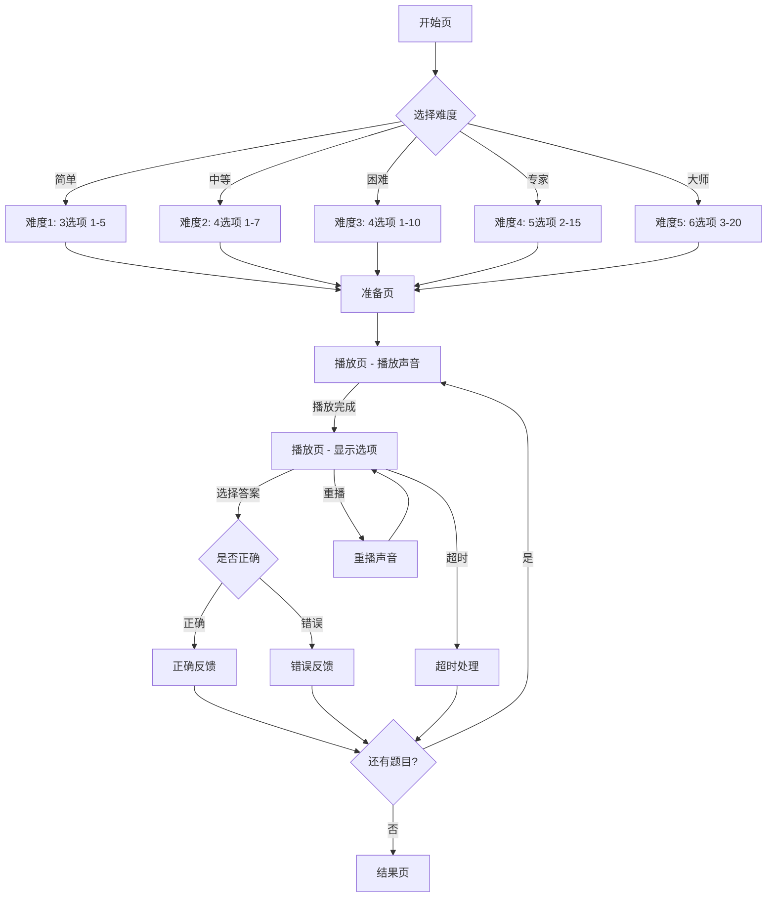

# 儿童专注力训练 - 游戏02听声辨数开发设计文档

## 文档信息

| 项目 | 内容 |
|------|------|
| 游戏编号 | 游戏02 |
| 游戏名称 | 听声辨数 (Audio Number) |
| 游戏类型 | 听觉专注力训练 |
| 目标年龄段 | 4-12岁 |
| 优先级 | P0 |

---

## 目录

1. [游戏概述](#1-游戏概述)
2. [页面结构设计](#2-页面结构设计)
3. [组件设计](#3-组件设计)
4. [状态管理设计](#4-状态管理设计)
5. [数据记录指标设计](#5-数据记录指标设计)
6. [技术实现要点](#6-技术实现要点)
7. [数据库表设计](#7-数据库表设计)

---

## 1. 游戏概述

### 1.1 游戏规则

听声辨数是经典的听觉注意力训练工具，通过听取播放的声音序列，然后选择正确的数字。

**核心玩法：**
- 屏幕显示多个数字选项（选项数量根据难度变化）
- 系统播放指定数量的声音（滴声/语音数字/节拍等）
- 玩家需要根据听到的声音数量选择对应数字
- 训练听觉计数能力和短时记忆能力

### 1.2 难度配置

```typescript
interface AudioNumberDifficulty {
  level: number;              // 难度等级 1-5
  optionCount: number;        // 选项数量 3-6
  minNumber: number;          // 最小数字
  maxNumber: number;          // 最大数字
  soundType: 'beep' | 'voice' | 'drum'; // 声音类型
  soundInterval: number;     // 声音间隔(ms)
  playCount: number;         // 每轮播放次数
  timeLimit: number;         // 答题时间限制(秒)
  allowReplay: boolean;      // 是否允许重播
  maxReplayCount: number;    // 最大重播次数
}

const AUDIO_NUMBER_DIFFICULTY_CONFIG = {
  // 等级1: 3选项，数量1-5，适合4-5岁
  level_1: {
    optionCount: 3,
    minNumber: 1,
    maxNumber: 5,
    soundType: 'beep',
    soundInterval: 800,
    playCount: 3,
    timeLimit: 15,
    allowReplay: true,
    maxReplayCount: 3,
  },
  
  // 等级2: 4选项，数量1-7，适合5-6岁
  level_2: {
    optionCount: 4,
    minNumber: 1,
    maxNumber: 7,
    soundType: 'beep',
    soundInterval: 700,
    playCount: 3,
    timeLimit: 12,
    allowReplay: true,
    maxReplayCount: 2,
  },
  
  // 等级3: 4选项，数量1-10，适合6-8岁
  level_3: {
    optionCount: 4,
    minNumber: 1,
    maxNumber: 10,
    soundType: 'voice',
    soundInterval: 600,
    playCount: 3,
    timeLimit: 10,
    allowReplay: true,
    maxReplayCount: 2,
  },
  
  // 等级4: 5选项，数量2-15，适合8-10岁
  level_4: {
    optionCount: 5,
    minNumber: 2,
    maxNumber: 15,
    soundType: 'voice',
    soundInterval: 500,
    playCount: 2,
    timeLimit: 8,
    allowReplay: true,
    maxReplayCount: 1,
  },
  
  // 等级5: 6选项，数量3-20，适合10-12岁
  level_5: {
    optionCount: 6,
    minNumber: 3,
    maxNumber: 20,
    soundType: 'drum',
    soundInterval: 400,
    playCount: 1,
    timeLimit: 6,
    allowReplay: false,
    maxReplayCount: 0,
  },
};
```

### 1.3 评分算法

```typescript
// 得分计算
function calculateAudioScore(params: {
  correctCount: number;
  totalCount: number;
  avgResponseTime: number;    // 平均反应时间(毫秒)
  replayCount: number;        // 总重播次数
  difficultyLevel: number;
  timeLimit: number;
}): number {
  const { correctCount, totalCount, avgResponseTime, replayCount, difficultyLevel, timeLimit } = params;
  
  // 基础分 = 正确率 × 100
  const accuracy = correctCount / totalCount;
  const baseScore = accuracy * 100;
  
  // 速度系数（反应时间越快越好）
  const timeRatio = Math.max(0, 1 - (avgResponseTime / (timeLimit * 1000)));
  const speedBonus = timeRatio * 30;
  
  // 记忆系数（重播次数越少越好）
  const replayPenalty = replayCount * 5;
  
  // 难度系数
  const difficultyFactor = difficultyLevel * 0.15 + 0.5;
  
  // 最终得分
  const finalScore = Math.round(
    (baseScore + speedBonus - replayPenalty) * difficultyFactor
  );
  
  return Math.max(0, Math.min(finalScore, 999));
}

// 星星计算
function calculateAudioStars(score: number, difficultyLevel: number): number {
  const thresholds = {
    1: [40, 70, 95],
    2: [50, 80, 100],
    3: [60, 85, 110],
    4: [70, 90, 120],
    5: [80, 100, 130],
  };
  
  const levelThresholds = thresholds[difficultyLevel as keyof typeof thresholds];
  
  if (score >= levelThresholds[2]) return 3;
  if (score >= levelThresholds[1]) return 2;
  if (score >= levelThresholds[0]) return 1;
  return 0;
}
```

---

## 2. 页面结构设计

### 2.1 页面列表

| 页面名称 | 路由 | 功能描述 |
|----------|------|----------|
| 听声辨数开始页 | /game/audio/start | 游戏说明、难度选择、开始 |
| 听声辨数准备页 | /game/audio/ready | 3-2-1倒计时 |
| 听声辨数播放页 | /game/audio/play | 播放声音、显示选项、等待答题 |
| 听声辨数结果页 | /game/audio/result | 展示成绩、星星、奖励 |

### 2.2 页面流程图



### 2.3 各页面功能说明

#### 2.3.1 开始页 (Start)

**布局要素：**
```
┌────────────────────────────────────────┐
│ ← 返回              听声辨数           │
├────────────────────────────────────────┤
│                                        │
│         [耳朵图标/动画]                 │
│                                        │
│    "仔细听，数一数有多少声音"           │
│                                        │
│   ┌────────────────────────────────┐   │
│   │  🏆 历史最佳                    │   │
│   │  得分: 125分  准确率: 92%       │   │
│   └────────────────────────────────┘   │
│                                        │
│   选择难度:                            │
│   ○ 简单 (3选项)  - 4-5岁             │
│   ● 中等 (4选项)  - 5-6岁  ✓推荐     │
│   ○ 困难 (4选项)  - 6-8岁              │
│   ○ 专家 (5选项)  - 8-10岁             │
│   ○ 大师 (6选项)  - 10-12岁            │
│                                        │
│   ┌────────────────────────────────┐   │
│   │                                │   │
│   │         开始游戏                │   │
│   │                                │   │
│   └────────────────────────────────┘   │
│                                        │
└────────────────────────────────────────┘
```

#### 2.3.2 游戏页 (Play)

**布局要素：**
```
┌────────────────────────────────────────┐
│ ← 返回        ⏱️ 02:35        ⏸️暂停   │
├────────────────────────────────────────┤
│                                        │
│            第 3 题 / 共 10 题          │
│                                        │
│        ┌──────────────────────┐        │
│        │                      │        │
│        │      🔊 播放中...     │        │
│        │                      │        │
│        │    ● ● ● ● ●        │        │
│        │   (声音指示点)        │        │
│        │                      │        │
│        │    [🔄 重播]         │        │
│        │                      │        │
│        └──────────────────────┘        │
│                                        │
│        ┌────────────────────────┐      │
│        │                        │      │
│        │   选择正确答案:         │      │
│        │                        │      │
│        │   [ 3 ] [ 4 ] [ 5 ]    │      │
│        │                        │      │
│        │       [ 6 ] [ 7 ]     │      │
│        │                        │      │
│        └────────────────────────┘      │
│                                        │
│            ✅ 正确: 2  ❌ 错误: 0      │
│                                        │
└────────────────────────────────────────┘
```

---

## 3. 组件设计

### 3.1 可复用组件列表

| 组件名 | 说明 | 复用范围 |
|--------|------|----------|
| AudioPlayer | 音频播放组件 | 通用 |
| NumberOptions | 数字选项组件 | 本游戏 |
| SoundIndicator | 声音指示器 | 本游戏 |
| ReplayButton | 重播按钮 | 本游戏 |
| DifficultySelector | 难度选择器 | 通用 |
| CountdownTimer | 倒计时组件 | 通用 |
| ResultModal | 结果弹窗 | 通用 |

### 3.2 AudioPlayer 组件

```typescript
interface AudioPlayerProps {
  soundType: 'beep' | 'voice' | 'drum';
  number: number;               // 要播放的数字
  interval: number;            // 声音间隔(ms)
  autoPlay?: boolean;          // 是否自动播放
  onPlayStart?: () => void;    // 开始播放回调
  onPlayEnd?: () => void;      // 播放完成回调
  onSoundPlay?: (index: number) => void; // 每个声音播放回调
}

// 状态
interface AudioPlayerState {
  isPlaying: boolean;
  currentSoundIndex: number;    // 当前播放到第几个声音
  totalSounds: number;         // 总声音数
  progress: number;           // 播放进度 0-100
}
```

### 3.3 NumberOptions 组件

```typescript
interface NumberOptionsProps {
  options: number[];           // 选项数字数组
  correctAnswer: number;       // 正确答案
  selectedAnswer: number | null; // 已选答案
  disabled: boolean;          // 是否禁用
  onSelect: (number: number) => void; // 选择回调
  layout?: 'grid' | 'row';     // 布局方式
  showResult?: boolean;        // 是否显示结果
}

// 选项状态
type OptionState = 'default' | 'selected' | 'correct' | 'wrong' | 'disabled';

// 状态样式
const OPTION_STYLES = {
  default: {
    backgroundColor: '#FFFFFF',
    borderColor: '#E0E0E0',
    textColor: '#333333',
  },
  selected: {
    backgroundColor: '#6C63FF',
    borderColor: '#6C63FF',
    textColor: '#FFFFFF',
  },
  correct: {
    backgroundColor: '#6BCB77',
    borderColor: '#6BCB77',
    textColor: '#FFFFFF',
  },
  wrong: {
    backgroundColor: '#FF8A80',
    borderColor: '#FF8A80',
    textColor: '#FFFFFF',
  },
  disabled: {
    backgroundColor: '#F5F5F5',
    borderColor: '#E0E0E0',
    textColor: '#BDBDBD',
  },
};
```

### 3.4 SoundIndicator 组件

```typescript
interface SoundIndicatorProps {
  totalCount: number;          // 总声音数
  currentIndex: number;        // 当前播放位置
  isPlaying: boolean;          // 是否正在播放
  size?: number;               // 圆点大小
  activeColor?: string;        // 激活颜色
  inactiveColor?: string;      // 未激活颜色
}

// 样式
const SOUND_INDICATOR_STYLES = {
  dot: {
    size: 12,
    activeColor: '#6C63FF',
    inactiveColor: '#E0E0E0',
    playingColor: '#FFD93D',   // 正在播放
  },
  progress: {
    height: 4,
    activeColor: '#6C63FF',
    inactiveColor: '#E0E0E0',
  },
};
```

### 3.5 ReplayButton 组件

```typescript
interface ReplayButtonProps {
  remainingCount: number;      // 剩余重播次数
  maxCount: number;           // 最大重播次数
  disabled: boolean;          // 是否禁用
  onPress: () => void;        // 点击回调
}

// 样式
const REPLAY_BUTTON_STYLES = {
  enabled: {
    backgroundColor: '#FFFFFF',
    borderColor: '#6C63FF',
    textColor: '#6C63FF',
  },
  disabled: {
    backgroundColor: '#F5F5F5',
    borderColor: '#E0E0E0',
    textColor: '#BDBDBD',
  },
  pressed: {
    transform: 'scale(0.95)',
    backgroundColor: '#F0EDFF',
  },
};
```

---

## 4. 状态管理设计

### 4.1 游戏核心状态数据结构

```typescript
// 听声辨数游戏状态
interface AudioNumberGameState {
  // 游戏基本信息
  gameId: string;
  gameCode: 'audio_number';
  
  // 难度配置
  difficulty: {
    level: number;
    optionCount: number;
    minNumber: number;
    maxNumber: number;
    soundType: 'beep' | 'voice' | 'drum';
    soundInterval: number;
    playCount: number;
    timeLimit: number;
    allowReplay: boolean;
    maxReplayCount: number;
  };
  
  // 题目配置
  questions: QuestionConfig[];  // 题目列表
  currentQuestionIndex: number; // 当前题目索引
  
  // 当前题目状态
  currentQuestion: {
    targetNumber: number;      // 目标数字
    options: number[];         // 选项
    correctAnswer: number;     // 正确答案
    selectedAnswer: number | null; // 已选答案
    isAnswered: boolean;       // 是否已回答
    isCorrect: boolean | null; // 是否正确
    responseTime: number;      // 反应时间(ms)
    replayCount: number;       // 重播次数
    isPlaying: boolean;        // 是否正在播放
  };
  
  // 游戏进度
  progress: {
    correctCount: number;
    errorCount: number;
    totalCount: number;
    startTime: number;
    elapsedTime: number;
  };
  
  // 游戏状态
  status: 'idle' | 'ready' | 'playing' | 'paused' | 'showing_result' | 'completed';
  
  // 结果数据
  result: {
    stars: number;
    score: number;
    accuracy: number;
    avgResponseTime: number;
    isNewBest: boolean;
  } | null;
}

// 题目配置
interface QuestionConfig {
  targetNumber: number;
  options: number[];
  correctAnswer: number;
}
```

### 4.2 状态流转逻辑

```typescript
// 状态流转
class AudioNumberGameEngine {
  // 生成题目
  generateQuestions(count: number, difficulty: DifficultyConfig): QuestionConfig[] {
    const questions: QuestionConfig[] = [];
    
    for (let i = 0; i < count; i++) {
      // 随机目标数字
      const targetNumber = this.randomInt(difficulty.minNumber, difficulty.maxNumber);
      
      // 生成选项（包含正确答案）
      const options = this.generateOptions(targetNumber, difficulty.optionCount, difficulty);
      
      questions.push({
        targetNumber,
        options,
        correctAnswer: targetNumber,
      });
    }
    
    return questions;
  }
  
  // 生成选项
  generateOptions(correct: number, count: number, difficulty: DifficultyConfig): number[] {
    const options = new Set<number>([correct]);
    
    while (options.size < count) {
      // 在正确答案附近生成干扰项
      const offset = this.randomInt(1, Math.max(2, Math.floor(correct * 0.5)));
      const干扰项 = Math.random() > 0.5 ? correct + offset : Math.max(1, correct - offset);
      
      if (干扰项 >= difficulty.minNumber && 干扰项 <= difficulty.maxNumber) {
        options.add(干扰项);
      }
    }
    
    // 打乱顺序
    return this.shuffleArray(Array.from(options));
  }
  
  // 开始播放
  async playSound(question: QuestionConfig) {
    this.updateState({ currentQuestion: { ...this.currentQuestion, isPlaying: true } });
    
    // 播放声音
    for (let i = 0; i < question.targetNumber; i++) {
      await this.audioPlayer.play();
      this.onSoundPlay?.(i);
      
      // 等待间隔
      await this.delay(this.difficulty.soundInterval);
    }
    
    this.updateState({ currentQuestion: { ...this.currentQuestion, isPlaying: false } });
    this.onPlayEnd?.();
  }
  
  // 处理选择
  handleSelectAnswer(answer: number) {
    if (this.currentQuestion.isAnswered) return;
    
    const isCorrect = answer === this.currentQuestion.correctAnswer;
    const responseTime = Date.now() - this.questionStartTime;
    
    this.updateState({
      currentQuestion: {
        ...this.currentQuestion,
        selectedAnswer: answer,
        isAnswered: true,
        isCorrect,
        responseTime,
      },
      progress: {
        ...this.progress,
        correctCount: isCorrect ? this.progress.correctCount + 1 : this.progress.correctCount,
        errorCount: isCorrect ? this.progress.errorCount : this.progress.errorCount + 1,
      },
    });
    
    // 显示结果后进入下一题
    setTimeout(() => {
      this.nextQuestion();
    }, 1500);
  }
  
  // 重播
  async replay() {
    if (this.currentQuestion.replayCount >= this.difficulty.maxReplayCount) return;
    
    this.updateState({
      currentQuestion: {
        ...this.currentQuestion,
        replayCount: this.currentQuestion.replayCount + 1,
      },
    });
    
    await this.playSound(this.currentQuestion);
  }
}
```

### 4.3 本地存储方案

```typescript
const AUDIO_STORAGE_KEYS = {
  PROGRESS: 'audio_progress',
  BEST_SCORE: 'audio_best_score',
  HISTORY: 'audio_history',
};

// 保存进度
function saveAudioProgress(state: AudioNumberGameState) {
  localStorage.setItem(AUDIO_STORAGE_KEYS.PROGRESS, JSON.stringify({
    gameId: state.gameId,
    difficulty: state.difficulty,
    progress: state.progress,
    currentQuestionIndex: state.currentQuestionIndex,
    status: state.status,
    savedAt: Date.now(),
  }));
}

// 获取最佳成绩
function getAudioBestScore(): { score: number; accuracy: number } | null {
  const saved = localStorage.getItem(AUDIO_STORAGE_KEYS.BEST_SCORE);
  return saved ? JSON.parse(saved) : null;
}
```

---

## 5. 数据记录指标设计

### 5.1 基础数据字段

```typescript
interface AudioNumberGameData {
  // ========== 基础信息 ==========
  recordId: string;
  childId: string;
  gameId: string;
  gameCode: 'audio_number';
  
  // ========== 游戏配置 ==========
  config: {
    difficultyLevel: number;
    optionCount: number;
    minNumber: number;
    maxNumber: number;
    soundType: 'beep' | 'voice' | 'drum';
    soundInterval: number;
    playCount: number;
    timeLimit: number;
    allowReplay: boolean;
    maxReplayCount: number;
  };
  
  // ========== 游戏过程数据 ==========
  gameplay: {
    startTime: string;
    endTime: string;
    durationSeconds: number;
    
    totalQuestions: number;
    correctCount: number;
    errorCount: number;
    accuracy: number;
    
    avgResponseTime: number;   // 平均反应时间
    totalReplayCount: number;  // 总重播次数
    
    completionStatus: 'completed' | 'abandoned';
  };
  
  // ========== 结果数据 ==========
  result: {
    score: number;
    stars: number;
    isNewBest: boolean;
    scoreFactors: {
      baseScore: number;
      speedBonus: number;
      accuracyBonus: number;
    };
  };
  
  // ========== 详细题目数据 ==========
  questions: QuestionRecord[];
  
  // ========== 获得奖励 ==========
  rewards: {
    experienceGained: number;
    achievementsUnlocked: string[];
  };
  
  // ========== 元数据 ==========
  metadata: {
    deviceInfo: string;
    appVersion: string;
    platform: string;
    sessionId: string;
  };
  
  createdAt: string;
}

// 单个题目记录
interface QuestionRecord {
  questionIndex: number;
  targetNumber: number;
  options: number[];
  selectedAnswer: number;
  isCorrect: boolean;
  responseTime: number;        // 反应时间(ms)
  replayCount: number;          // 该题重播次数
  wasTimeout: boolean;        // 是否超时
}
```

### 5.2 数据上报时机

```typescript
const AUDIO_REPORT_TIMING = {
  onGameStart: {
    eventName: 'audio_game_start',
    data: ['gameId', 'config', 'childId'],
  },
  
  onSoundPlay: {
    eventName: 'audio_sound_play',
    data: ['questionIndex', 'soundIndex', 'targetNumber'],
    reportType: 'batch',
    batchInterval: 10000,
  },
  
  onAnswer: {
    eventName: 'audio_answer',
    data: ['questionIndex', 'selectedAnswer', 'isCorrect', 'responseTime', 'replayCount'],
    reportType: 'event',
  },
  
  onGameEnd: {
    eventName: 'audio_game_end',
    data: ['completionStatus', 'durationSeconds', 'correctCount', 'accuracy'],
    reportType: 'event',
  },
  
  onGameComplete: {
    eventName: 'audio_game_complete',
    data: 'full',
    reportType: 'final',
  },
};
```

---

## 6. 技术实现要点

### 6.1 音频播放实现

```typescript
// 音频播放引擎
class AudioEngine {
  private audioContext: AudioContext;
  private buffers: Map<string, AudioBuffer>;
  
  constructor() {
    this.audioContext = new (window.AudioContext || (window as any).webkitAudioContext)();
    this.buffers = new Map();
  }
  
  // 初始化音频
  async init() {
    // 预加载所有音频
    const sounds = ['beep', 'voice_1', 'voice_2', 'voice_3', 'drum'];
    for (const sound of sounds) {
      await this.loadSound(sound);
    }
  }
  
  // 加载音频
  async loadSound(name: string): Promise<AudioBuffer> {
    const response = await fetch(`/assets/audio/${name}.mp3`);
    const arrayBuffer = await response.arrayBuffer();
    const audioBuffer = await this.audioContext.decodeAudioData(arrayBuffer);
    this.buffers.set(name, audioBuffer);
    return audioBuffer;
  }
  
  // 播放声音
  playSound(type: 'beep' | 'voice' | 'drum', index?: number) {
    const name = type === 'voice' ? `voice_${index}` : type;
    const buffer = this.buffers.get(name);
    
    if (!buffer) return;
    
    const source = this.audioContext.createBufferSource();
    source.buffer = buffer;
    source.connect(this.audioContext.destination);
    source.start();
    
    return source;
  }
  
  // 播放序列
  async playSequence(
    targetNumber: number,
    soundType: 'beep' | 'voice' | 'drum',
    interval: number,
    onEachPlay?: (index: number) => void
  ) {
    for (let i = 0; i < targetNumber; i++) {
      this.playSound(soundType, soundType === 'voice' ? i + 1 : undefined);
      onEachPlay?.(i);
      await this.delay(interval);
    }
  }
  
  // 清理
  dispose() {
    this.audioContext.close();
  }
}

// Web Audio API 配置
const AUDIO_CONFIG = {
  // 声音参数
  beep: {
    frequency: 800,            // 频率(Hz)
    duration: 150,             // 时长(ms)
    type: 'sine',              // 波形
    volume: 0.5,
  },
  drum: {
    frequency: 200,
    duration: 100,
    type: 'triangle',
    volume: 0.6,
  },
  voice: {
    // 使用预录音频
    volume: 0.8,
  },
};
```

### 6.2 震动反馈

```typescript
const AUDIO_HAPTIC = {
  // 播放声音时的轻微反馈
  onSoundPlay: {
    type: 'impactLight',
  },
  // 选择正确
  onCorrect: {
    type: 'notificationSuccess',
  },
  // 选择错误
  onWrong: {
    type: 'notificationError',
  },
  // 游戏完成
  onComplete: {
    type: 'notificationSuccess',
  },
};
```

---

## 7. 数据库表设计

### 7.1 听声辨数专用表

```sql
-- 听声辨数训练记录表
CREATE TABLE `audio_training_record` (
    `id` BIGINT UNSIGNED NOT NULL AUTO_INCREMENT COMMENT '记录ID',
    `record_id` VARCHAR(64) NOT NULL COMMENT '记录唯一标识',
    `child_id` BIGINT UNSIGNED NOT NULL COMMENT '儿童ID',
    `game_id` BIGINT UNSIGNED NOT NULL COMMENT '游戏配置ID',
    
    -- 游戏配置
    `difficulty_level` TINYINT NOT NULL DEFAULT 1,
    `option_count` TINYINT NOT NULL COMMENT '选项数量',
    `min_number` INT NOT NULL COMMENT '最小数字',
    `max_number` INT NOT NULL COMMENT '最大数字',
    `sound_type` VARCHAR(20) NOT NULL COMMENT '声音类型',
    `sound_interval` INT NOT NULL COMMENT '声音间隔(ms)',
    `time_limit` INT NOT NULL COMMENT '时间限制(秒)',
    `allow_replay` TINYINT NOT NULL COMMENT '允许重播',
    `max_replay_count` INT NOT NULL COMMENT '最大重播次数',
    
    -- 游戏结果
    `start_time` DATETIME NOT NULL,
    `end_time` DATETIME NOT NULL,
    `duration_seconds` INT NOT NULL,
    
    `total_questions` INT NOT NULL COMMENT '总题目数',
    `correct_count` INT NOT NULL DEFAULT 0,
    `error_count` INT NOT NULL DEFAULT 0,
    `accuracy` DECIMAL(5,2) NOT NULL COMMENT '准确率',
    
    `avg_response_time` INT NOT NULL COMMENT '平均反应时间(ms)',
    `total_replay_count` INT NOT NULL DEFAULT 0 COMMENT '总重播次数',
    
    `score` INT NOT NULL COMMENT '得分',
    `stars` TINYINT NOT NULL DEFAULT 0,
    `is_new_best` TINYINT NOT NULL DEFAULT 0,
    
    `experience_gained` INT NOT NULL DEFAULT 0,
    
    `device_info` VARCHAR(255) DEFAULT NULL,
    `app_version` VARCHAR(20) DEFAULT NULL,
    `session_id` VARCHAR(64) DEFAULT NULL,
    
    `created_at` DATETIME NOT NULL DEFAULT CURRENT_TIMESTAMP,
    
    PRIMARY KEY (`id`),
    UNIQUE KEY `uk_record_id` (`record_id`),
    KEY `idx_child_id` (`child_id`),
    KEY `idx_game_id` (`game_id`),
    KEY `idx_child_created` (`child_id`, `created_at`),
    KEY `idx_score` (`child_id`, `score`)
) ENGINE=InnoDB DEFAULT CHARSET=utf8mb4 COLLATE=utf8mb4_unicode_ci COMMENT='听声辨数训练记录表';
```

### 7.2 听声辨数题目记录表

```sql
-- 听声辨数题目记录表
CREATE TABLE `audio_question_record` (
    `id` BIGINT UNSIGNED NOT NULL AUTO_INCREMENT COMMENT '记录ID',
    `record_id` VARCHAR(64) NOT NULL COMMENT '关联的训练记录ID',
    `child_id` BIGINT UNSIGNED NOT NULL COMMENT '儿童ID',
    
    `question_index` INT NOT NULL COMMENT '题目序号',
    `target_number` INT NOT NULL COMMENT '目标数字',
    `options` JSON NOT NULL COMMENT '选项列表',
    `selected_answer` INT DEFAULT NULL COMMENT '选择的答案',
    `is_correct` TINYINT DEFAULT NULL COMMENT '是否正确',
    
    `response_time` INT DEFAULT NULL COMMENT '反应时间(ms)',
    `replay_count` INT NOT NULL DEFAULT 0 COMMENT '重播次数',
    `was_timeout` TINYINT NOT NULL DEFAULT 0 COMMENT '是否超时',
    
    `created_at` DATETIME NOT NULL DEFAULT CURRENT_TIMESTAMP,
    
    PRIMARY KEY (`id`),
    KEY `idx_record_id` (`record_id`),
    KEY `idx_child_id` (`child_id`)
) ENGINE=InnoDB DEFAULT CHARSET=utf8mb4 COLLATE=utf8mb4_unicode_ci COMMENT='听声辨数题目记录表';
```
